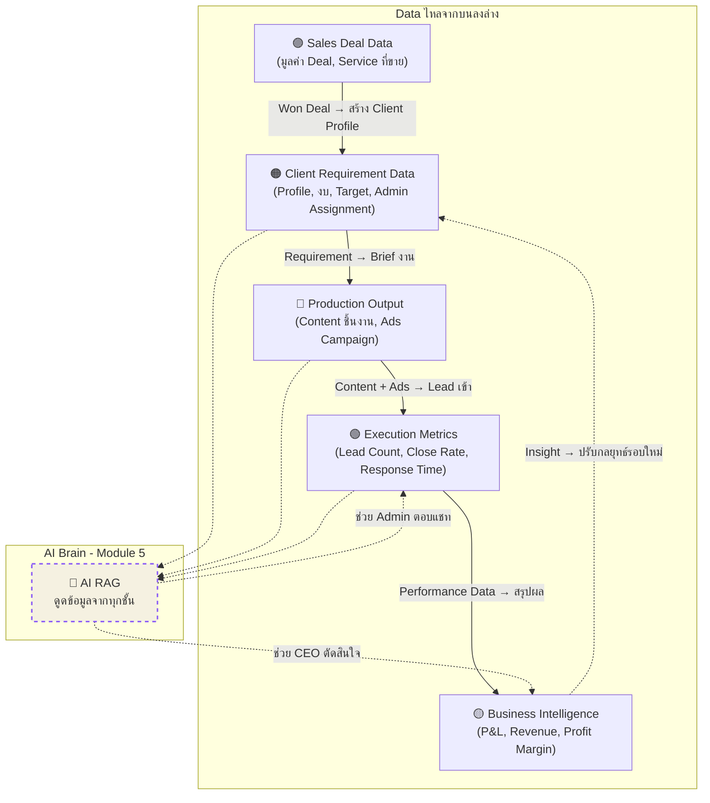

# 🔄 MarkTech Media — Agency Journey Flow (Top-to-Bottom)

> แสดง Journey ทั้งหมดของ Media Agency ตั้งแต่ขายได้ลูกค้าจนถึงต่อสัญญา — ทุกส่วนเชื่อมกันผ่าน Module ต่างๆ ใน MarkTech OS

---

## Full Agency Journey

```mermaid
flowchart TB
    %% ===== PHASE 1: SALES =====
    subgraph SALES["🟣 Phase 1 — Sales (ทีม Sale)"]
        S1["🎯 หา Prospect ใหม่\n(คลินิก / ธุรกิจความงาม)"]
        S2["📞 Contact & Demo\nนำเสนอ Service ของ Marktech"]
        S3["📄 Proposal & Negotiation\nเลือก Service Package"]
        S4["✅ Close Deal — Won!\nลูกค้าตกลงใช้บริการ"]
        S1 --> S2 --> S3 --> S4
    end

    %% ===== PHASE 2: ONBOARDING =====
    subgraph ONBOARD["🟠 Phase 2 — Onboarding (AM + ทุกฝ่าย)"]
        O1["📋 AM กรอก Client Profile Card\nชื่อคลินิก, เจ้าของ, Brand Guideline"]
        O2["✏️ เก็บ Requirement Checklist\nงบแอด, กลุ่มเป้าหมาย, โปรโมชัน, คำต้องห้าม"]
        O3{"ลูกค้าเลือก\nService อะไรบ้าง?"}
        O4["📢 Performance Marketing\nวางแผนแอด + งบ"]
        O5["🎨 Marketing Content\n12 ชิ้น/เดือน"]
        O6["💬 Page Admin\nตอบแชท 08:00-20:00"]
        O7{"Admin ตอบแชท:\nระบุแอดมินแล้ว?"}
        O8["✅ พร้อมเริ่มงาน"]
        O9["⚠️ สถานะ: รอระบุแอดมิน\n(ต้องจัดการก่อนวันขึ้นงาน)"]
        
        O1 --> O2 --> O3
        O3 -->|"Ads"| O4
        O3 -->|"Content"| O5
        O3 -->|"Admin"| O6
        O6 --> O7
        O7 -->|"ระบุแล้ว"| O8
        O7 -->|"ยังไม่ระบุ"| O9
        O9 -.->|"จัดการเสร็จ"| O8
        O4 --> O8
        O5 --> O8
    end

    %% ===== PHASE 3: PRODUCTION =====
    subgraph PRODUCTION["🔵 Phase 3 — Production (Content + Graphic + Ads)"]
        P1["📝 Content Team\nเขียนแคปชัน + วางแผนโพสต์"]
        P2["🎨 Graphic Team\nออกแบบภาพ / วิดีโอ"]
        P3["👁️ Internal Review\nหัวหน้าตรวจงาน"]
        P4["📤 ส่ง Approve ลูกค้า"]
        P5{"ลูกค้า Approve?"}
        P6["✅ อัปโหลดลงเพจ\nจัดคิวโพสต์"]
        P7["🔄 แก้ไขตาม Feedback"]
        P8["📊 Ads Team\nวางแผน + ขึ้นโฆษณา"]
        
        P1 --> P2 --> P3 --> P4 --> P5
        P5 -->|"Approve"| P6
        P5 -->|"แก้ไข"| P7
        P7 --> P3
        P6 --> P8
    end

    %% ===== PHASE 4: EXECUTION =====
    subgraph EXECUTION["🟢 Phase 4 — Execution (Admin + Ads)"]
        E1["📱 แอดเริ่มยิง\nLead เข้ามา"]
        E2["💬 Admin ตอบแชท\nทุกเพจ ทุกช่องทาง"]
        E3["📊 AI RAG ช่วย\nแนะนำสคริปต์ + ข้อมูลหัตถการ"]
        E4{"Lead ปิดการขาย\nสำเร็จ?"}
        E5["✅ ปิดได้ — นับยอด\nคำนวณ Incentive"]
        E6["❌ ไม่ปิด — บันทึกเหตุผล\nFollow-up ภายหลัง"]
        E7["📈 Ads Optimize\nปรับ Campaign ตาม Performance"]
        
        E1 --> E2
        E3 -.->|"ช่วยตอบ"| E2
        E2 --> E4
        E4 -->|"ปิดได้"| E5
        E4 -->|"ไม่ปิด"| E6
        E1 --> E7
        E7 -.->|"ปรับแอดให้ดีขึ้น"| E1
    end

    %% ===== PHASE 5: REPORT & RETAIN =====
    subgraph REPORT["🟡 Phase 5 — Report & Retain (AM + CEO)"]
        R1["📊 สรุปผลรายเดือน\nLead, Close Rate, ROAS, P&L"]
        R2["📧 Auto Monthly Report\nส่ง Email CEO + AM"]
        R3["🤝 ประชุมกับลูกค้า\nนำเสนอผลงาน + แนะนำเดือนถัดไป"]
        R4{"ลูกค้าพอใจ?"}
        R5["✅ ต่อสัญญา\n+ Upsell Service เพิ่ม"]
        R6["⚠️ Warning\nเข้า Retention Plan"]
        
        R1 --> R2 --> R3 --> R4
        R4 -->|"พอใจ"| R5
        R4 -->|"ไม่พอใจ"| R6
    end

    %% ===== CONNECTIONS BETWEEN PHASES =====
    S4 ==>|"Deal Won → สร้าง Onboarding Tasks"| O1
    O8 ==>|"Requirement ไหลเข้าระบบ"| P1
    O8 ==>|"งบ + Target"| P8
    P8 ==>|"แอดเริ่มยิง"| E1
    P6 ==>|"Content พร้อม"| E1
    E5 ==>|"ยอดปิด + Performance Data"| R1
    E6 ==>|"ข้อมูล Lost Lead"| R1
    E7 ==>|"Ads Performance"| R1
    R5 -.->|"วนรอบใหม่\nเดือนถัดไป"| P1
    R6 -.->|"ปรับกลยุทธ์"| P1

    %% ===== STYLING =====
    style SALES fill:#7c3aed15,stroke:#7c3aed,stroke-width:2px
    style ONBOARD fill:#f9731615,stroke:#f97316,stroke-width:2px
    style PRODUCTION fill:#3b82f615,stroke:#3b82f6,stroke-width:2px
    style EXECUTION fill:#22c55e15,stroke:#22c55e,stroke-width:2px
    style REPORT fill:#eab30815,stroke:#eab308,stroke-width:2px
```

---

## Module Mapping (แต่ละ Phase ใช้ Module อะไร)

| Phase | Module หลัก | Module สนับสนุน |
|---|---|---|
| **🟣 Sales** | Module 1B — Sales Pipeline | Module 4 (Commission) |
| **🟠 Onboarding** | Module 3 — Client Requirement Hub | Module 1A (ระบุ Admin), Module 5 (AI ดูดข้อมูล) |
| **🔵 Production** | Module 2 — Operation & Content | Module 6 (Ticket แก้ไข) |
| **🟢 Execution** | Module 1A — Admin CRM | Module 5 (AI RAG ช่วยตอบ), Module 4 (Incentive) |
| **🟡 Report** | Module 3 — P&L Dashboard | Cross-Module (Auto Report + Backup) |

---

## Data Flow ข้ามระบบ

---

> [!TIP]
> **สิ่งที่เห็นจากภาพรวม:**
> - ทุก Phase เชื่อมกันแบบ **บนลงล่าง** — ข้อมูลจาก Phase ก่อนหน้าไหลเข้า Phase ถัดไปเสมอ
> - **AI Brain (Module 5)** ทำหน้าที่เป็น **"แกนกลาง"** ที่ดูดข้อมูลจากทุกชั้นมาสนับสนุนการทำงาน
> - **จุดวนรอบ (Loop):** เมื่อถึง Phase 5 (Report) → จะวนกลับไป Phase 3 (Production) เพื่อเริ่มรอบเดือนใหม่
> - **จุดที่คุณเพิ่งขอ:** อยู่ตรง Phase 2 → ถ้าลูกค้าเลือก "Admin ตอบแชท" ต้องระบุแอดมินก่อน ไม่งั้นสถานะค้างที่ "รอระบุแอดมิน"
