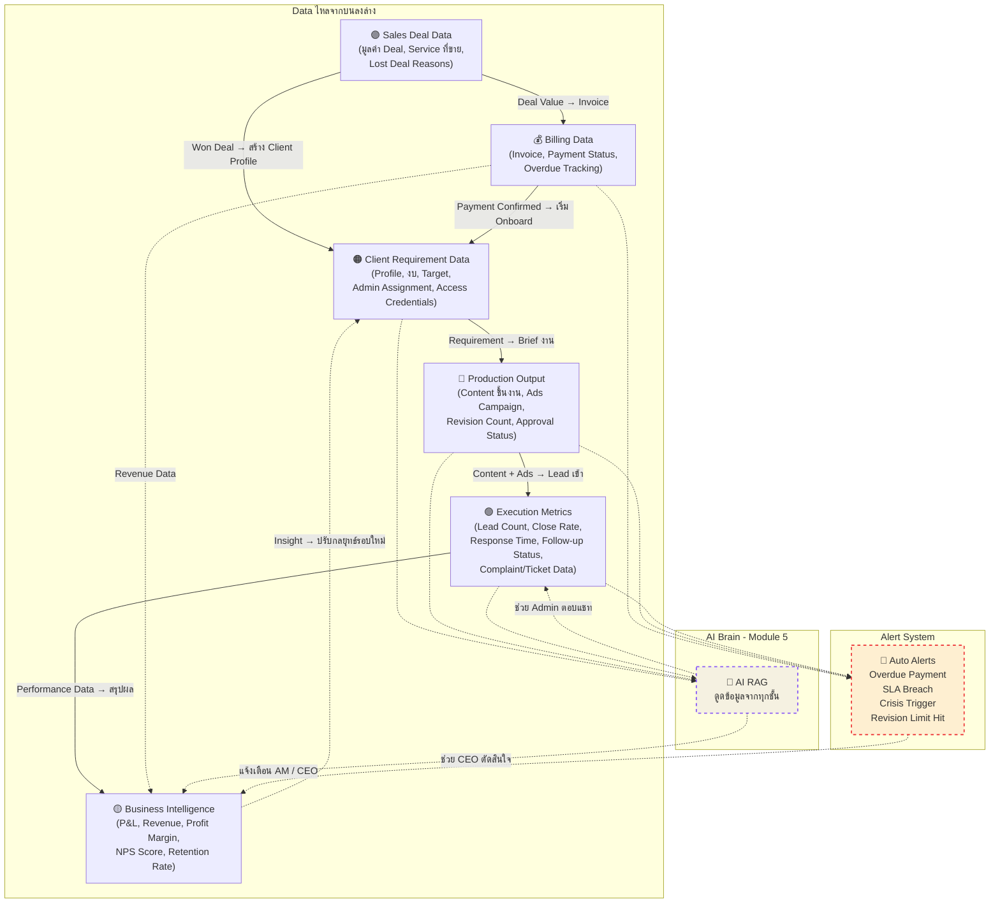

# 🔄 MarkTech Media — Agency Journey Flow v2.0 (Comprehensive)

> แสดง Journey ทั้งหมดของ Media Agency ตั้งแต่ขายได้ลูกค้าจนถึงต่อสัญญา / ยกเลิก — ครอบคลุมทุกสถานการณ์ รวม Exception, Crisis, Billing, และ Offboarding

---

## Full Agency Journey (Updated)

```mermaid
flowchart TB
    %% ===== PHASE 1: SALES =====
    subgraph SALES["🟣 Phase 1 — Sales (ทีม Sale)"]
        S1["🎯 หา Prospect ใหม่\n(คลินิก / ธุรกิจความงาม)\nช่องทาง: Referral, Cold Call, Event"]
        S2["📞 Contact & Demo\nนำเสนอ Service ของ Marktech\nส่ง Portfolio + Case Study"]
        S3["📄 Proposal & Quotation\nเลือก Service Package\nออกใบเสนอราคา"]
        S4{"Prospect ตัดสินใจ?"}
        S5["✅ Close Deal — Won!\nลูกค้าตกลงใช้บริการ\nเซ็นสัญญา + วาง Deposit"]
        S6["❌ Lost Deal\nบันทึกเหตุผล (ราคา/Timing/คู่แข่ง)"]
        S7["📂 Nurture Pipeline\nส่ง Content / Case Study ทุก 2 สัปดาห์"]
        S8["🗄️ Archive\nไม่ใช่ Target / ปิดถาวร"]

        S1 --> S2 --> S3 --> S4
        S4 -->|"ตกลง"| S5
        S4 -->|"ไม่ตกลง"| S6
        S6 --> S7
        S7 -.->|"กลับมาสนใจ"| S3
        S7 -->|"ไม่สนใจ > 90 วัน"| S8
        S8 -.->|"กลับมาติดต่อ"| S2
    end

    %% ===== PHASE 1.5: BILLING =====
    subgraph BILLING["💰 Phase 1.5 — Billing & Contract (Finance)"]
        B1["📄 ออกใบเสนอราคา\n+ รายละเอียด Package"]
        B2["📝 เซ็นสัญญา\nระบุ: ระยะเวลา, SLA,\nRevision Limit, ค่าปรับ"]
        B3["💳 รับ Deposit / งวดแรก\nออกใบเสร็จ"]
        B4["📅 ตั้ง Billing Cycle\nรายเดือน: วางบิลทุกวันที่ 25\nDue Date: วันที่ 5 เดือนถัดไป"]
        B5{"ชำระตรงเวลา?"}
        B6["✅ ชำระแล้ว\nอัปเดตสถานะ"]
        B7["⚠️ Overdue\nDay 1: แจ้ง AM\nDay 7: แจ้งลูกค้า\nDay 14: CEO โทรตาม\nDay 30: พิจารณาหยุดงาน"]

        B1 --> B2 --> B3 --> B4 --> B5
        B5 -->|"ตรงเวลา"| B6
        B5 -->|"เกินกำหนด"| B7
        B7 -.->|"ชำระแล้ว"| B6
    end

    %% ===== PHASE 2: ONBOARDING =====
    subgraph ONBOARD["🟠 Phase 2 — Onboarding (AM + ทุกฝ่าย)"]
        O0["🤝 Sale Handoff → AM\nส่งมอบ: สัญญา, ใบเสนอราคา,\nContact Info, สิ่งที่ตกลงพิเศษ\nDeadline: ภายใน 2 วันทำการ"]
        O1["📋 AM กรอก Client Profile Card\nชื่อคลินิก, เจ้าของ, Brand Guideline\nช่องทางสื่อสาร, วัน-เวลาที่สะดวก"]
        O2["✏️ เก็บ Requirement Checklist\nงบแอด, กลุ่มเป้าหมาย, โปรโมชัน,\nคำต้องห้าม, คู่แข่ง, USP"]
        O2A["📱 ขอ Access ทุกช่องทาง\nFacebook Page, Ad Account,\nLINE OA, Google Analytics"]
        O3{"ลูกค้าเลือก\nService อะไรบ้าง?"}
        O4["📢 Performance Marketing\nวางแผนแอด + งบ + Target"]
        O5["🎨 Marketing Content\n12 ชิ้น/เดือน"]
        O6["💬 Page Admin\nตอบแชท 08:00-20:00"]
        O7{"Admin ตอบแชท:\nระบุแอดมินแล้ว?"}
        O8["✅ Requirement พร้อม"]
        O9["⚠️ สถานะ: รอระบุแอดมิน\n(ต้องจัดการก่อนวันขึ้นงาน)"]
        O10["🎉 Kick-off Meeting\nAM + ทีมงาน + ลูกค้า\nยืนยัน: Timeline, KPI เป้าหมาย,\nช่องทางสื่อสาร, Reporting Day"]

        O0 --> O1 --> O2 --> O2A --> O3
        O3 -->|"Ads"| O4
        O3 -->|"Content"| O5
        O3 -->|"Admin"| O6
        O6 --> O7
        O7 -->|"ระบุแล้ว"| O8
        O7 -->|"ยังไม่ระบุ"| O9
        O9 -.->|"จัดการเสร็จ"| O8
        O4 --> O8
        O5 --> O8
        O8 --> O10
    end

    %% ===== PHASE 3: PRODUCTION =====
    subgraph PRODUCTION["🔵 Phase 3 — Production (Content + Graphic + Ads)"]
        P1["📝 Content Team\nเขียนแคปชัน + วางแผนโพสต์\nอิง Content Calendar"]
        P2["🎨 Graphic Team\nออกแบบภาพ / วิดีโอ\nตาม Brand Guideline"]
        P3["👁️ Internal Review\nหัวหน้าตรวจงาน\nChecklist: ถูกต้อง, ตรง Brand, ไม่ผิด กม."]
        P4["📤 ส่ง Approve ลูกค้า\nผ่านระบบ / LINE\nDeadline ตอบ: 48 ชม."]
        P5{"ลูกค้า Approve?"}
        P6["✅ อัปโหลดลงเพจ\nจัดคิวโพสต์"]
        P7["🔄 แก้ไขตาม Feedback\nนับครั้ง: Revision #N"]
        P7A{"แก้ไขเกิน\n3 ครั้ง?"}
        P7B["⚠️ Escalate → AM\nแจ้งลูกค้า: Revision เกิน SLA\nคิดค่าแก้เพิ่ม / ประชุมปรับ Brief"]
        P8["📊 Ads Team\nวางแผน + ขึ้นโฆษณา"]
        P9{"Ads ผ่าน Review?"}
        P10["✅ Ads Live"]
        P11["🚫 Ads Rejected\nวิเคราะห์เหตุผล\nแก้ไข Creative / Copy"]
        P12{"ลูกค้าไม่ตอบ\n> 48 ชม.?"}
        P13["📱 AM ติดตาม\nโทร + LINE แจ้งเตือน"]
        P14["⏸️ Auto-approve\nตามเงื่อนไขในสัญญา\n(ถ้ามีข้อตกลง)"]

        P1 --> P2 --> P3 --> P4
        P4 --> P12
        P12 -->|"ตอบแล้ว"| P5
        P12 -->|"ไม่ตอบ > 48 ชม."| P13
        P13 -->|"ลูกค้าตอบ"| P5
        P13 -->|"ไม่ตอบ > 72 ชม."| P14
        P5 -->|"Approve"| P6
        P5 -->|"แก้ไข"| P7
        P7 --> P7A
        P7A -->|"ไม่เกิน"| P3
        P7A -->|"เกิน 3 ครั้ง"| P7B
        P7B --> P3
        P6 --> P8
        P8 --> P9
        P9 -->|"ผ่าน"| P10
        P9 -->|"Rejected"| P11
        P11 --> P8
    end

    %% ===== PHASE 4: EXECUTION =====
    subgraph EXECUTION["🟢 Phase 4 — Execution (Admin + Ads)"]
        E1["📱 แอดเริ่มยิง\nLead เข้ามา"]
        E2["💬 Admin ตอบแชท\nทุกเพจ ทุกช่องทาง\nSLA: ตอบภายใน 5 นาที (ในเวลางาน)"]
        E3["📊 AI RAG ช่วย\nแนะนำสคริปต์ + ข้อมูลหัตถการ"]
        E4{"Lead ปิดการขาย\nสำเร็จ?"}
        E5["✅ ปิดได้ — นับยอด\nคำนวณ Incentive\nอัปเดต CRM"]
        E6["❌ ไม่ปิด — บันทึกเหตุผล"]
        E6A{"ประเภท Lost Lead?"}
        E6B["🔄 Follow-up Plan\nDay 3: ส่งข้อมูลเพิ่ม\nDay 7: โทรติดตาม\nDay 14: ส่งโปรพิเศษ\nDay 30: ปิด Case"]
        E6C["🚫 Not Qualified\n(นอกพื้นที่ / งบไม่พอ / ไม่ใช่กลุ่มเป้าหมาย)\nบันทึก + ปิด"]
        E7["📈 Ads Optimize\nปรับ Campaign ตาม Performance\nA/B Test Creative"]
        E8["🚨 Complaint / Issue\nลูกค้าของคลินิกร้องเรียน"]
        E9["📋 สร้าง Ticket\nระบุ Priority: Low/Med/High/Critical"]
        E10{"Priority Level?"}
        E11["🟡 Low-Med\nAdmin + AM จัดการ\nSLA: ภายใน 24 ชม."]
        E12["🔴 High-Critical\nEscalate → CEO + คลินิก\nSLA: ภายใน 2 ชม."]

        E1 --> E2
        E3 -.->|"ช่วยตอบ"| E2
        E2 --> E4
        E4 -->|"ปิดได้"| E5
        E4 -->|"ไม่ปิด"| E6
        E6 --> E6A
        E6A -->|"ยังมีโอกาส"| E6B
        E6A -->|"ไม่ Qualify"| E6C
        E6B -.->|"สนใจกลับมา"| E2
        E1 --> E7
        E7 -.->|"ปรับแอดให้ดีขึ้น"| E1
        E2 --> E8
        E8 --> E9 --> E10
        E10 -->|"Low-Med"| E11
        E10 -->|"High-Critical"| E12
    end

    %% ===== PHASE 4.5: CRISIS =====
    subgraph CRISIS["🔴 Emergency / Crisis Management"]
        C1{"ประเภท Crisis?"}
        C2["🔒 เพจโดนแฮก\n1. แจ้ง Meta ทันที\n2. เปลี่ยน Password ทุกคน\n3. ตรวจ Admin Access\n4. แจ้งลูกค้า"]
        C3["🚫 Ad Account ถูก Ban\n1. Submit Appeal\n2. ตรวจ Creative ที่ผิด Policy\n3. เตรียม Backup Account\n4. แจ้งลูกค้า + ปรับแผน"]
        C4["⚖️ ปัญหากฎหมาย\n(ลูกค้าโดนฟ้อง / Content ผิด กม.)\n1. ถอด Content ทันที\n2. แจ้ง CEO\n3. ประสาน Legal\n4. ออก Statement (ถ้าจำเป็น)"]
        C5["📉 Performance ดิ่งหนัก\n(ROAS < 1 ติดต่อ 2 สัปดาห์)\n1. หยุดแอดที่ Perform แย่\n2. วิเคราะห์ Root Cause\n3. ประชุมด่วนกับลูกค้า\n4. Pivot Strategy"]
        C6["✅ Crisis Resolved\nสรุป Post-mortem Report\nปรับ SOP ป้องกันซ้ำ"]

        C1 -->|"เพจโดนแฮก"| C2
        C1 -->|"Ad Ban"| C3
        C1 -->|"Legal Issue"| C4
        C1 -->|"Performance Crisis"| C5
        C2 --> C6
        C3 --> C6
        C4 --> C6
        C5 --> C6
    end

    %% ===== PHASE 5: REPORT & RETAIN =====
    subgraph REPORT["🟡 Phase 5 — Report & Retain (AM + CEO)"]
        R1["📊 สรุปผลรายเดือน\nLead, Close Rate, ROAS, CPI,\nP&L, Content Performance"]
        R2["📧 Auto Monthly Report\nส่ง Email CEO + AM + ลูกค้า"]
        R3["🤝 Monthly Review Meeting\nAM + ลูกค้า\nนำเสนอผลงาน + แนะนำเดือนถัดไป"]
        R4{"NPS / Satisfaction\nScore?"}
        R5["✅ Score ≥ 8\nต่อสัญญา + Upsell\nเสนอ Service เพิ่ม"]
        R6["⚠️ Score 5-7\nRetention Plan:\n1. ประชุมเชิงลึก\n2. ปรับกลยุทธ์ฟรี 1 เดือน\n3. เพิ่ม Touchpoint\n4. Review ทุก 2 สัปดาห์"]
        R7["🔴 Score < 5\nCritical Retention:\n1. CEO เข้าประชุม\n2. Action Plan ภายใน 48 ชม.\n3. ลดค่าบริการชั่วคราว?\n4. ถ้ายัง → เข้ากระบวนการ Offboard"]

        R1 --> R2 --> R3 --> R4
        R4 -->|"≥ 8"| R5
        R4 -->|"5-7"| R6
        R4 -->|"< 5"| R7
        R6 -.->|"ดีขึ้น"| R5
        R6 -.->|"ไม่ดีขึ้น > 2 เดือน"| R7
    end

    %% ===== PHASE 6: OFFBOARDING =====
    subgraph OFFBOARD["⚫ Phase 6 — Offboarding (ยกเลิกสัญญา)"]
        X1["📝 แจ้งยกเลิก\n(ลูกค้าแจ้ง หรือ เราตัดสินใจ)\nNotice Period: ตามสัญญา"]
        X2["📋 Offboarding Checklist"]
        X3["🔑 คืน Access ทุกช่องทาง\nPage Admin, Ad Account,\nLINE OA, Google Analytics"]
        X4["📂 ส่งมอบไฟล์งานทั้งหมด\nContent, Design Source Files,\nAds Report, Customer Data"]
        X5["💰 เคลียร์การเงิน\nค่าบริการค้าง, ค่าแอดค้าง,\nDeposit คืน (ถ้ามี)"]
        X6["📊 Final Report\nสรุปผลตลอดสัญญา\nข้อมูลที่เป็นประโยชน์ให้ลูกค้า"]
        X7["🤝 Exit Interview\nเก็บ Feedback\nเหตุผลการยกเลิก"]
        X8["🗄️ Archive Client Data\nเก็บข้อมูลไว้ 1 ปี\nลบข้อมูลส่วนบุคคลตาม PDPA"]
        X9["👋 ปิดโปรเจค\nย้ายลูกค้าเข้า Alumni List\nส่ง Thank You + เปิดช่องกลับมา"]

        X1 --> X2
        X2 --> X3
        X2 --> X4
        X2 --> X5
        X2 --> X6
        X3 --> X7
        X4 --> X7
        X5 --> X7
        X6 --> X7
        X7 --> X8 --> X9
        X9 -.->|"กลับมาใช้บริการ"| S2
    end

    %% ===== CONNECTIONS BETWEEN PHASES =====
    S5 ==>|"Deal Won → Handoff to AM"| O0
    S5 ==>|"ออกใบเสนอราคา"| B1
    B3 ==>|"ชำระแล้ว → เริ่ม Onboard"| O0
    O10 ==>|"Kick-off Done → Brief งาน"| P1
    O10 ==>|"งบ + Target + KPI"| P8
    P10 ==>|"แอดเริ่มยิง"| E1
    P6 ==>|"Content พร้อม"| E1
    E5 ==>|"ยอดปิด + Performance Data"| R1
    E6C ==>|"ข้อมูล Lost Lead"| R1
    E6B ==>|"Follow-up Data"| R1
    E7 ==>|"Ads Performance"| R1
    E11 ==>|"Ticket Data"| R1
    E12 ==>|"Escalation Record"| R1
    R5 -.->|"วนรอบใหม่\nเดือนถัดไป"| P1
    R6 -.->|"ปรับกลยุทธ์"| P1
    R7 -->|"ยกเลิก"| X1
    B7 -->|"ค้างชำระ > 30 วัน"| X1

    %% Crisis can happen anywhere
    E2 -.->|"เกิด Crisis"| C1
    P10 -.->|"Ads ถูก Ban"| C1
    C6 -.->|"กลับเข้า Flow ปกติ"| E7

    %% ===== STYLING =====
    style SALES fill:#7c3aed15,stroke:#7c3aed,stroke-width:2px
    style BILLING fill:#06b6d415,stroke:#06b6d4,stroke-width:2px
    style ONBOARD fill:#f9731615,stroke:#f97316,stroke-width:2px
    style PRODUCTION fill:#3b82f615,stroke:#3b82f6,stroke-width:2px
    style EXECUTION fill:#22c55e15,stroke:#22c55e,stroke-width:2px
    style CRISIS fill:#ef444415,stroke:#ef4444,stroke-width:2px,stroke-dasharray: 5 5
    style REPORT fill:#eab30815,stroke:#eab308,stroke-width:2px
    style OFFBOARD fill:#6b728015,stroke:#6b7280,stroke-width:2px
```

---

## Module Mapping v2.0 (แต่ละ Phase ใช้ Module อะไร)

| Phase | Module หลัก | Module สนับสนุน | Owner |
|---|---|---|---|
| **🟣 Sales** | Module 1B — Sales Pipeline | Module 4 (Commission) | Sale Team |
| **💰 Billing** | Module 7 — Finance & Invoice | Module 1B (Deal Value) | Finance / CEO |
| **🟠 Onboarding** | Module 3 — Client Requirement Hub | Module 1A (ระบุ Admin), Module 5 (AI ดูดข้อมูล) | AM |
| **🔵 Production** | Module 2 — Operation & Content | Module 6 (Ticket แก้ไข) | Content Lead |
| **🟢 Execution** | Module 1A — Admin CRM | Module 5 (AI RAG), Module 4 (Incentive) | Admin Team |
| **🔴 Crisis** | Module 6 — Escalation & Ticket | All Modules (Cross-functional) | CEO + AM |
| **🟡 Report** | Module 3 — P&L Dashboard | Cross-Module (Auto Report) | AM + CEO |
| **⚫ Offboard** | Module 7 — Finance | Module 3 (Final Report) | AM + Finance |

---

## Data Flow ข้ามระบบ (Updated)

---

## Communication Matrix (ใครคุยกับใคร ผ่านช่องทางไหน)

| สถานการณ์ | ช่องทาง | ผู้รับผิดชอบ | SLA |
|---|---|---|---|
| **Prospect Follow-up** | โทร + LINE | Sale | ภายใน 24 ชม. หลัง Lead เข้า |
| **Onboarding ประสานงาน** | LINE Group (AM + ลูกค้า) | AM | ตอบภายใน 4 ชม. (เวลางาน) |
| **Content Approval** | ระบบ Approve / LINE | AM → ลูกค้า | ลูกค้าตอบภายใน 48 ชม. |
| **Admin ตอบแชท Lead** | Facebook Inbox / LINE OA | Admin | ภายใน 5 นาที (ในเวลางาน) |
| **Monthly Report** | Email + Meeting (Zoom/Onsite) | AM | ส่ง Report ก่อนประชุม 2 วัน |
| **Complaint / Escalation** | LINE / โทร | AM → CEO (ถ้า Critical) | Low: 24 ชม. / Critical: 2 ชม. |
| **Crisis** | โทรทันที + LINE Group | CEO + AM | ภายใน 30 นาที |
| **Invoice / Billing** | Email + LINE | Finance / AM | ส่งบิลตามรอบ |
| **Offboarding** | Email (เป็นทางการ) + Meeting | AM | ตาม Notice Period ในสัญญา |

---

## SLA & Escalation Matrix

| Metric | Target | Warning | Escalate to |
|---|---|---|---|
| **Admin Response Time** | ≤ 5 นาที | > 15 นาที | AM |
| **Content Revision** | ≤ 3 ครั้ง/ชิ้น | ครั้งที่ 3 | AM → ลูกค้า |
| **Client Approval** | ≤ 48 ชม. | > 48 ชม. AM ติดตาม | > 72 ชม. Auto-approve (ถ้ามีข้อตกลง) |
| **Ads Review (Meta)** | ผ่านครั้งแรก | Rejected | Ads Team แก้ + resubmit |
| **Monthly Payment** | ตรงเวลา | Day 7 Overdue | Day 14: CEO / Day 30: พิจารณาหยุดงาน |
| **ROAS** | ≥ 3x | < 2x ติดต่อ 2 สัปดาห์ | CEO + ลูกค้าประชุมด่วน |
| **NPS Score** | ≥ 8 | 5-7: Retention Plan | < 5: CEO เข้ามา |
| **Crisis Response** | ≤ 30 นาที | > 1 ชม. | CEO ทันที |

---

## Checklist Templates

### Sale → AM Handoff Checklist
- [ ] สัญญาที่เซ็นแล้ว (PDF)
- [ ] ใบเสนอราคาที่ลูกค้า Approve
- [ ] Contact Info: ชื่อ, เบอร์, LINE, Email ของผู้ประสานงาน
- [ ] Service Package ที่เลือก + ราคา
- [ ] ข้อตกลงพิเศษ / ส่วนลด / เงื่อนไขเพิ่มเติม
- [ ] วันที่คาดว่าจะเริ่มงาน
- [ ] งบโฆษณา / เดือน
- [ ] Notes จาก Sale (สิ่งที่ลูกค้าให้ความสำคัญ)

### Onboarding Checklist
- [ ] Client Profile Card กรอกครบ
- [ ] Brand Guideline / CI ได้รับแล้ว
- [ ] Facebook Page Access — ได้รับ Admin/Editor
- [ ] Ad Account Access — ได้รับสิทธิ์
- [ ] LINE OA Access (ถ้ามี)
- [ ] Requirement Checklist ครบ
- [ ] Admin ตอบแชท — ระบุตัวแล้ว
- [ ] Kick-off Meeting จัดแล้ว
- [ ] Timeline & KPI ยืนยันแล้ว
- [ ] Billing Cycle ตั้งค่าแล้ว

### Offboarding Checklist
- [ ] แจ้งยกเลิกเป็นลายลักษณ์อักษร
- [ ] คืน Facebook Page Admin Access
- [ ] คืน Ad Account Access
- [ ] คืน LINE OA Access
- [ ] ส่งมอบ Source Files ทั้งหมด (PSD, AI, Video)
- [ ] ส่งมอบ Content Calendar & Assets
- [ ] ส่ง Final Performance Report
- [ ] เคลียร์ค่าบริการค้าง
- [ ] เคลียร์ค่าโฆษณาค้าง
- [ ] คืน Deposit (ถ้ามี)
- [ ] Exit Interview เสร็จแล้ว
- [ ] Archive ข้อมูลลูกค้า
- [ ] ลบข้อมูลส่วนบุคคลตาม PDPA (หลัง 1 ปี)

---

> [!TIP]
> **สิ่งที่เพิ่มใหม่ใน v2.0:**
> 1. **Lost Deal Path** — Prospect ที่ไม่ปิด จะเข้า Nurture Pipeline หรือ Archive
> 2. **Billing & Contract Phase** — ครบวงจรตั้งแต่ใบเสนอราคาจนถึงตามเงิน
> 3. **Sale → AM Handoff** — มี Checklist ชัดเจน + Deadline 2 วันทำการ
> 4. **Kick-off Meeting** — เป็น Step แยก ก่อนเริ่ม Production
> 5. **Access Request** — ขอสิทธิ์ Facebook, Ad Account, LINE OA ตั้งแต่ Onboarding
> 6. **Revision Limit** — แก้ไขเกิน 3 ครั้ง → Escalate
> 7. **Client ไม่ตอบ Approve** — มี Flow ติดตาม 48 ชม. → 72 ชม. → Auto-approve
> 8. **Ads Rejected** — มี Loop แก้ไข + Resubmit
> 9. **Follow-up Plan** — Lost Lead มีแผนติดตาม Day 3/7/14/30
> 10. **Complaint & Ticket System** — Priority Level + SLA
> 11. **Crisis Management** — 4 สถานการณ์: แฮก, Ban, Legal, Performance ดิ่ง
> 12. **NPS-based Retention** — Score ≥8 / 5-7 / <5 คนละ Action
> 13. **Offboarding** — ส่งมอบ Access, ไฟล์, เคลียร์เงิน, Exit Interview, PDPA
> 14. **Communication Matrix** — ใครคุยกับใคร ผ่านช่องไหน SLA เท่าไร
> 15. **Alert System** — แจ้งเตือนอัตโนมัติเมื่อ SLA breach
> 16. **Alumni List** — ลูกค้าที่ยกเลิกยังมีช่องทางกลับมา
