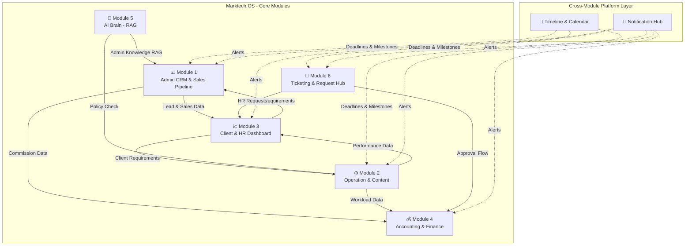
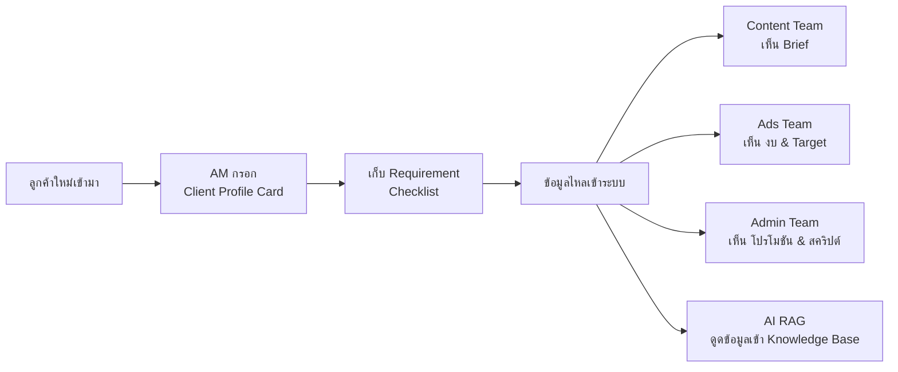
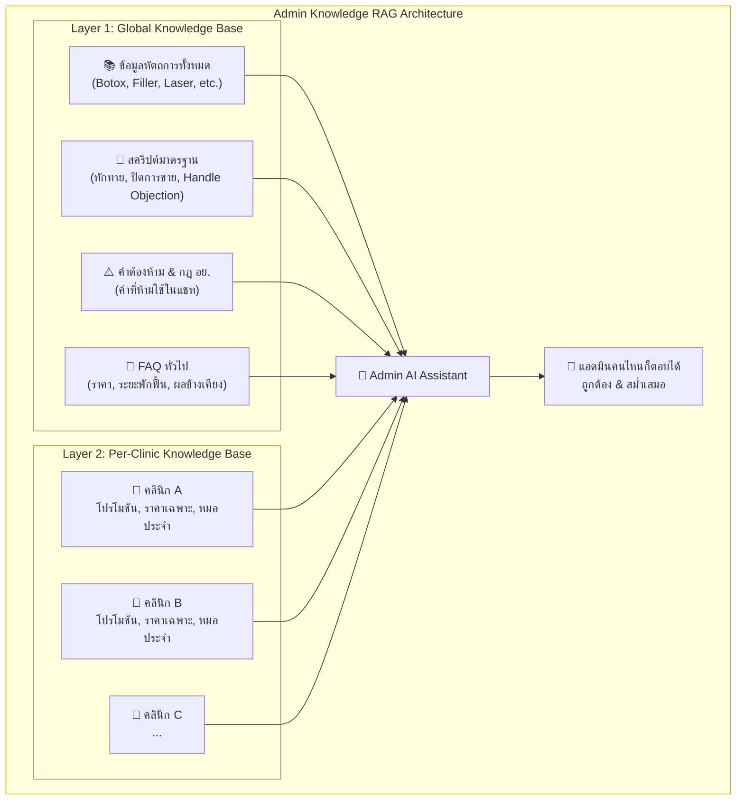
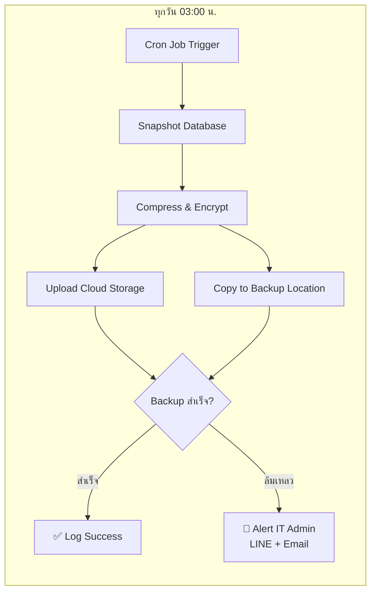
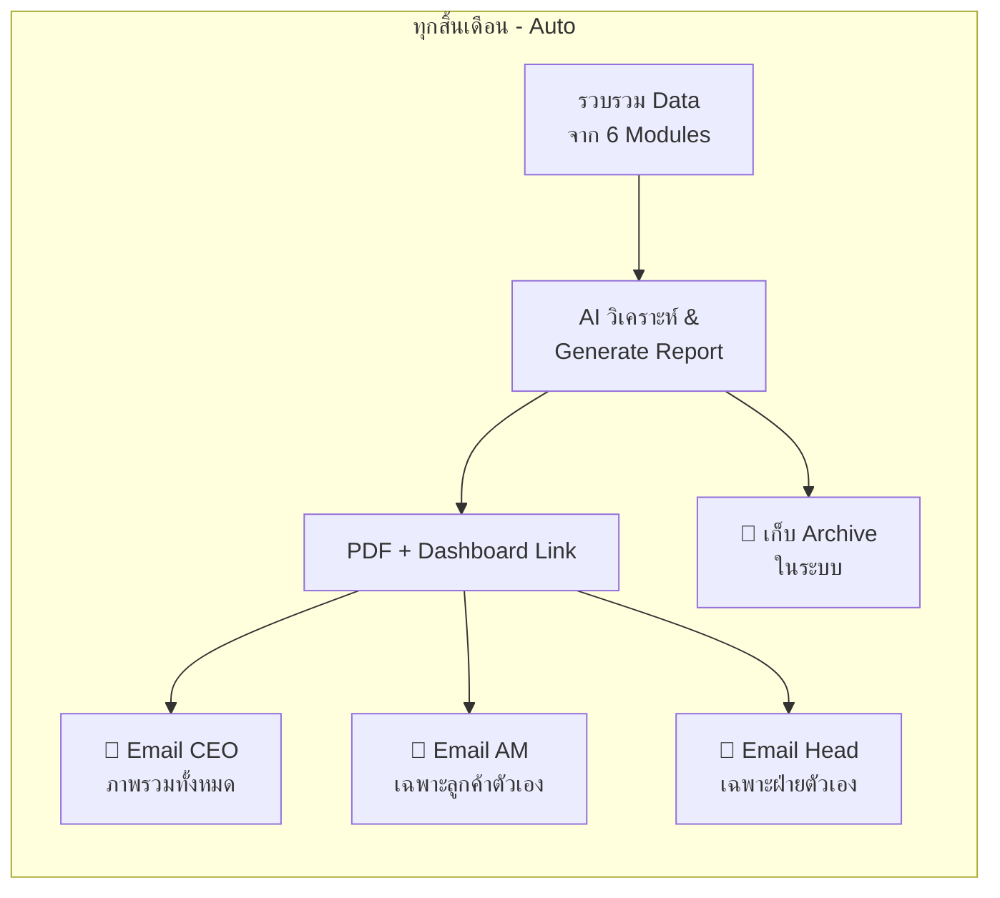
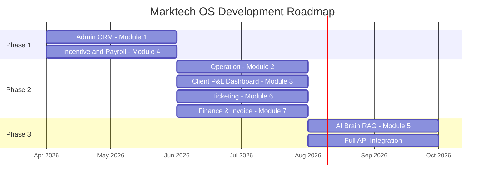

# 📋 Marktech OS — Project Proposal & Business Requirement Document

> **The Ultimate Data-Driven Agency Platform**

| รายการ | รายละเอียด |
|---|---|
| **จัดทำโดย** | หาโร (HR Consultant) |
| **เสนอ** | คุณตั้ม (CEO) และทีมผู้บริหาร Marktech Media |
| **สำหรับ** | ทีม Development และ ทีม Management |
| **วันที่** | มีนาคม 2026 |

---

## 1. Executive Summary (บทสรุปผู้บริหาร)

**Marktech OS** คือระบบ Web Application แบบ **All-in-one** ที่ถูกออกแบบมาเพื่อแก้ปัญหาคอขวดในการบริหารจัดการองค์กรของ Marktech Media โดยเฉพาะการเปลี่ยนผ่านวัฒนธรรมองค์กรจาก **"การทำงานด้วยความเกรงใจ"** ไปสู่ **"การทำงานที่วัดผลด้วย Data"**

### Core Objectives

| # | วัตถุประสงค์ | รายละเอียด |
|---|---|---|
| 1 | **Maximize Profit & Efficiency** | ลดต้นทุนแฝงจากพนักงานที่ผลงานไม่ถึงเกณฑ์ และเพิ่มยอดขายผ่านระบบคัดกรองและกระตุ้นการทำงานด้วย Gamification |
| 2 | **Single Source of Truth** | รวมระบบการทำงานทั้งหมด (CRM, Operation, Accounting, HR) ไว้ในที่เดียว เพื่อยกเลิกการใช้ซอฟต์แวร์ภายนอกที่ซ้ำซ้อนและมีราคาแพง (เช่น Monday.com) |
| 3 | **Scale Without Limits** | วางโครงสร้าง AI (RAG) และระบบ Ticketing เพื่อลดภาระของผู้บริหารในการตอบคำถามและการอนุมัติงานยิบย่อย ทำให้ CEO และระดับ Lead สามารถโฟกัสที่การขยายฐานลูกค้าได้อย่างเต็มที่ |

---

## 2. 🛠️ System Modules (รายละเอียดระบบสำหรับทีม Dev)

ระบบ Marktech OS ประกอบด้วย **7 โมดูลหลัก + 1 Cross-Module Platform Layer** ที่เชื่อมโยงข้อมูลถึงกัน (Data Integration):

---

### 🔲 Cross-Module: Project Timeline, Calendar & Notification Hub

> **เป้าหมาย:** ให้ทุกฝ่ายเห็นภาพรวมงานเดียวกัน มี Deadline ชัดเจน และได้รับแจ้งเตือนอัตโนมัติ — ไม่มีงานหลุดหรือตกหล่น

> [!IMPORTANT]
> ระบบนี้เป็น **Platform Layer** ที่ทำงานข้ามทุก Module — ไม่ใช่ Module แยก แต่เป็นโครงสร้างพื้นฐานที่ทุก Module เรียกใช้ร่วมกัน

| Feature | รายละเอียด |
|---|---|
| **Unified Project Timeline** | แสดง Gantt-style timeline ของทุกโปรเจกต์ลูกค้า — ตั้งแต่ Onboarding, ผลิต Content, ยิงแอด จนถึง Report — ทุกฝ่ายเห็นสถานะเดียวกัน real-time |
| **Shared Calendar** | ปฏิทินกลางรวม Deadline ส่งงาน, วันนัด Approve, วันวางบิล, วันจ่ายเงินเดือน, วันหยุดนักขัตฤกษ์ — กรองดูตามฝ่าย/คน/โปรเจกต์ได้ |
| **Smart Notification Hub** | ศูนย์แจ้งเตือนแบบ Multi-channel — แจ้งเตือนบนระบบ (In-app), push ไปยัง LINE (ผ่าน LINE Notify API), และ Email |
| **Role-Based Alerts** | แจ้งเตือนตามบทบาท เช่น Admin ได้รับ noti เมื่อมี Lead เข้า / Content ได้รับ noti เมื่องาน Approve แล้ว / CEO ได้รับ noti สรุปรายวัน |
| **Deadline Escalation** | หากงานเลยกำหนด → แจ้งเตือนหัวหน้าทีมอัตโนมัติ → หากยังไม่แก้ใน 24 ชม. → แจ้ง AM/CEO |

**ตัวอย่าง Notification ตามฝ่าย:**

| ฝ่าย | ตัวอย่างการแจ้งเตือน |
|---|---|
| **Admin** | 🔔 Lead ใหม่เข้ามา 3 รายการ / ⚠️ คุณยังไม่ตอบ Lead #127 (เกิน 15 นาที) / 🎉 ยอดปิดถึง 40% แล้ว! |
| **Content & Graphic** | 📋 งานใหม่: แคปชัน คลินิก ABC (Deadline: พรุ่งนี้ 12:00) / ✅ งาน #45 ได้รับ Approve แล้ว |
| **Ads** | 📊 ROAS คลินิก XYZ ต่ำกว่าเกณฑ์ 3 วันติด / 💰 งบแอดเหลือ 20% — ต้องขอเพิ่ม? |
| **AM / CEO** | 📈 สรุปรายวัน: ปิดการขาย 15 เคส / ยอดรวม ฿xxx / ⚠️ พนักงาน 2 คนต่ำกว่าเกณฑ์ |
| **บัญชี** | 💳 รอบวางบิลคลินิก ABC ครบกำหนดใน 3 วัน / 📅 วันจ่ายเงินเดือน: เหลืออีก 5 วัน |

---

### 🆕 Service Catalog — บริการของ Marktech Media

> **หมายเหตุ:** ทำความเข้าใจ Service ก่อน เพราะทุก Module ในระบบจะอิงตาม Service เหล่านี้

> [!IMPORTANT]
> **Admin ≠ Sale** — เป็นคนละบทบาท:
> - **Admin (Page Admin)** = พนักงานตอบแชทลูกค้าบนเพจ Facebook/LINE ของคลินิก (ให้บริการ Page Admin Service)
> - **Sale** = พนักงานขายบริการของ Marktech Media ให้กับธุรกิจลูกค้า (คลินิก, ร้านค้า ฯลฯ)

#### Service 1: Monthly Performance Marketing Service

บริการดูแลโฆษณาออนไลน์ครบวงจร:

| # | หัวข้อ | รายละเอียด |
|---|---|---|
| 1 | **วางแผนโฆษณา (Advertising Strategy)** | วิเคราะห์กลุ่มเป้าหมาย พื้นที่ทำเล จุดขาย และแนวทางขึ้นแอดสำหรับบริการของคลินิก |
| 2 | **ขึ้นโฆษณา (Ad Creation & Management)** | จัดการและยิงโฆษณาแบบ **ไม่จำกัดจำนวนชุดแอด** |
| 3 | **ควบคุมงบ (Budget Management)** | ช่วยควบคุมการใช้จ่ายให้มีประสิทธิภาพสูงสุดภายใต้งบประมาณที่ลูกค้ากำหนด |
| 4 | **ปรับแอดให้เกิดผลสูงสุด (Optimization)** | วิเคราะห์ผลแอดรายสัปดาห์ ปรับกลุ่มเป้าหมาย / คอนเทนต์ / งบ เพื่อให้ได้ CTR, CPL, CPM ที่ดีที่สุด |
| 5 | **รายงานผล & สรุปประสิทธิภาพ** | สรุปผลเป็นรายเดือน พร้อมคำแนะนำการพัฒนาต่อเนื่อง |

#### Service 2: Marketing Content

บริการผลิตคอนเทนต์ดูแลเพจ:

| # | หัวข้อ | รายละเอียด |
|---|---|---|
| 1 | **วิเคราะห์เพจ & วางแผนคอนเทนต์** | ตรวจสอบเนื้อหาเดิมของเพจ และวางธีม/แผนโพสต์ให้เหมาะกับกลุ่มเป้าหมาย |
| 2 | **แนะนำแนวทางคอนเทนต์** | เสนอหัวข้อ พร้อมไกด์ไลน์สำหรับการสื่อสาร |
| 3 | **ออกแบบคอนเทนต์ (12 ชิ้น/เดือน)** | คอนเทนต์ภาพนิ่งพร้อม caption เช่น โปรโมชั่น / ความรู้ / รีวิว ฯลฯ |
| 4 | **อัปโหลดลงเพจ** | จัดคิวโพสต์ตามแผน ให้เหมาะสมในแต่ละวัน |
| 5 | **ปรับปรุงตามผลตอบรับ** | แนะนำการปรับรูปแบบโพสต์ในเดือนถัดไป จาก Report |

#### Service 3: Page Admin

บริการแอดมินตอบแชทให้ลูกค้า:

| # | หัวข้อ | รายละเอียด |
|---|---|---|
| 1 | **ตอบแชทลูกค้า 08:00–20:00 ทุกวัน** | ตอบกลับข้อความลูกค้าใน Inbox, คอมเมนต์ และช่องทางที่เกี่ยวข้อง พร้อมใช้สคริปต์บริการหรือแนวทางที่ตกลงไว้ |
| 2 | **สรุปบทสนทนา (Chat Summary Report)** | สรุปบทสนทนาแต่ละวัน แจ้งจำนวนข้อความ ปัญหาหรือคำถามที่พบบ่อย |
| 3 | **รวบรวมข้อมูลคิว/จอง/ความต้องการ** | แยกเก็บข้อมูลลูกค้าที่สนใจ เช่น วันที่จอง / บริการที่สอบถาม / ข้อมูลติดต่อ |
| 4 | **วิเคราะห์พฤติกรรมลูกค้าเบื้องต้น** | วิเคราะห์คำถามที่พบบ่อย เวลาเข้าแชทบ่อยสุด ประเภทบริการที่สนใจ — นำไปปรับกลยุทธ์แอดและเนื้อหา |
| 5 | **แนะนำการพัฒนา Workflow การตอบแชท** | ช่วยพัฒนา script การตอบ การจัดการแชท และการส่งต่อภายในทีมให้มีประสิทธิภาพยิ่งขึ้น |

---

### Module 1: Admin CRM & Sales Pipeline (ระบบเครื่องจักรทำยอด)

> [!IMPORTANT]
> Module นี้แบ่งเป็น **2 ส่วนแยกกัน** ตามบทบาท:
> - **Admin CRM** — จัดการทีม Page Admin (ตอบแชท), วัด Performance, คำนวณ Incentive
> - **Sales Pipeline** — จัดการทีม Sale ที่ขายบริการ Marktech Media ให้ธุรกิจใหม่

#### 1A: Admin CRM (ระบบจัดการ Page Admin)

> **เป้าหมาย:** จัดการทีม Admin ที่ตอบแชทเพจลูกค้า ควบคุมคุณภาพการตอบ และคำนวณ Incentive อัตโนมัติ

| Feature | รายละเอียด |
|---|---|
| **Auto-Lead Routing** | ดึง API จากช่องทางโซเชียลมีเดีย → ระบบจ่ายแชทลูกค้า (Lead) ให้ Admin ตามคิวหรือตาม Performance อัตโนมัติ (ป้องกัน Cherry-picking) |
| **Real-time Performance Dashboard** | หน้าจอแสดงผลงานรายบุคคลแบบ Real-time: รับกี่ Lead, ปิดได้กี่ %, ความเร็วในการตอบ |
| **Auto-Incentive & Gamification** | คำนวณเงินค่าคอมมิชชันตาม Tier อัตโนมัติ พร้อมแจ้งเตือนกระตุ้นยอด |

#### 1B: Sales Pipeline (ระบบจัดการทีมขาย)

> **เป้าหมาย:** ติดตาม Sales Funnel ของทีมขาย — ตั้งแต่ Prospect → Demo → Proposal → Close Deal

| Feature | รายละเอียด |
|---|---|
| **Sales Funnel Board** | Kanban-style pipeline: Prospect → Contacted → Demo/Proposal → Negotiation → Won/Lost |
| **Service Catalog Integration** | เลือก Service ที่จะเสนอ (Performance Marketing / Content / Page Admin) พร้อมคำนวณรายได้คาดการณ์ |
| **Deal Tracking** | ติดตามมูลค่า Deal, ความน่าจะปิด (%), Expected Revenue รายเดือน |
| **Commission for Sales** | คำนวณ Commission สำหรับ Sales แยกจาก Admin |

---

### Module 2: Operation & Content (ระบบโรงงานผลิตงาน)

> **เป้าหมาย:** ทดแทน Monday.com และใช้วัดคุณภาพงานของทีมหลังบ้าน (Ads, Content, Graphic) ด้วยผลลัพธ์จริง

| Feature | รายละเอียด |
|---|---|
| **Task Management & Workflow** | ระบบจ่ายงานและติดตามสถานะ (To-do → Doing → Approve) |
| **Ads Performance Sync** | ผูกข้อมูลผลลัพธ์โฆษณา (CPL, ROAS จาก Facebook API) เข้ากับชิ้นงาน Content/Graphic → ทราบทันทีว่าภาพหรือแคปชันของใครสร้างรายได้จริง |
| **Quality HR Tracking** | เก็บ Data ประสิทธิภาพงานของพนักงานแต่ละคน เพื่อใช้ประเมินโบนัสและปรับเลื่อนตำแหน่งประจำปีอย่างโปร่งใส |

---

### Module 3: Client & HR Dashboard (ศูนย์บัญชาการ CEO)

> **เป้าหมาย:** สำหรับผู้บริหารและ AM ในการดูภาพรวมกำไร-ขาดทุน, เก็บ Requirement ลูกค้า และเฝ้าระวังปัญหาพนักงาน

| Feature | รายละเอียด |
|---|---|
| **🆕 Client Onboarding & Requirement Hub** | *(ดูรายละเอียดด้านล่าง)* |
| **Project P&L (Unit Economics)** | แสดงกำไรสุทธิแบบรายคลินิก (รายรับ − ต้นทุนค่าแอด − ต้นทุนเวลาพนักงาน − ค่าคอมมิชชัน) เพื่อประเมินความคุ้มค่าและคำนวณ Profit Sharing ให้ Partner/Lead |
| **HR Warning System** | แจ้งเตือนผู้บริหารอัตโนมัติ หากมีพนักงานผลงานต่ำกว่าเกณฑ์ (เช่น Admin ยอดปิดต่ำกว่า 30% ติดต่อกัน 2 สัปดาห์) → เข้าสู่กระบวนการ **PIP (Performance Improvement Plan)** ทันที |

#### 🆕 Client Onboarding & Requirement Hub (ระบบเก็บ Requirement ลูกค้า)

> **ปัญหาปัจจุบัน:** ข้อมูลลูกค้ากระจัดกระจายอยู่ใน LINE, Google Drive, หรือ "ในหัว" ของ AM — เมื่อ AM ไม่อยู่หรือเปลี่ยนคน ข้อมูลหาย ทำให้เกิดข้อผิดพลาดซ้ำๆ

ระบบจัดเก็บความต้องการลูกค้า (Client Requirement) อย่างเป็นระบบ **ตั้งแต่ก่อนเริ่มงาน** เพื่อให้ทุกฝ่ายเข้าถึงข้อมูลเดียวกันได้ทันที:

| Feature | รายละเอียด |
|---|---|
| **Client Profile Card** | ข้อมูลพื้นฐานของลูกค้าแต่ละราย: ชื่อคลินิก, เจ้าของ, ช่องทางติดต่อ, Brand Guideline, โทนเสียงที่ต้องการ, โลโก้/สี/ฟอนต์ |
| **Service Requirement Checklist** | Checklist มาตรฐานสำหรับ Onboarding ลูกค้าใหม่ — เช่น จำนวน Content/เดือน, งบยิงแอด, กลุ่มเป้าหมาย, หัตถการที่ให้บริการ, โปรโมชันปัจจุบัน, ข้อจำกัด/คำต้องห้าม |
| **Communication Log** | บันทึกการสนทนา/ข้อตกลงกับลูกค้าทุกครั้ง (สรุป Meeting Note, การปรับ Scope, ข้อร้องเรียน) — ค้นหาได้ตาม วันที่/หัวข้อ/คนบันทึก |
| **Approval Preferences** | ลูกค้าต้องการ Approve งานผ่านช่องทางไหน? (LINE/Email/ระบบ) และใครเป็นคน Approve |
| **Contract & SLA Tracking** | ระยะเวลาสัญญา, วันต่อสัญญา, ระดับ SLA ที่ตกลงกัน — แจ้งเตือนล่วงหน้า 30 วันก่อนหมดสัญญา |

> [!TIP]
> **ข้อดีหลัก:** เมื่อเปลี่ยน AM, เปลี่ยน Content, หรือเปลี่ยน Admin — คนใหม่สามารถเปิดดู Client Profile Card แล้วเริ่มงานได้ทันทีโดยไม่ต้องถามใคร

---

### Module 4: Accounting & Finance (ระบบบัญชีและการเงิน)

> **เป้าหมาย:** อุดรอยรั่วทางการเงิน, จ่ายค่าคอมมิชชันเป๊ะแบบไร้ข้อกังขา

| Feature | รายละเอียด |
|---|---|
| **Auto-Payroll & Commission** | ดึงข้อมูลจาก Module 1 และ 2 มาคำนวณเงินเดือนรวม Incentive แบบอัตโนมัติ |
| **Time Attendance & Deductions** | ระบบลงเวลาเข้างาน — หากสายหรือขาดงาน ระบบคำนวณการหักเงินอัตโนมัติ (ลดการปะทะและตัดความเกรงใจของหัวหน้า) |
| **Ad Spend & Cashflow Routing** | คุมงบยิงแอด, แจ้งเตือนรอบวางบิล และแยกกระเป๋า "ค่าบริการ" กับ "ค่าแอด" อย่างชัดเจน |

---

### Module 5: Marktech AI Brain (Internal RAG System)

> **เป้าหมาย:** สร้าง "สมองกล" ของบริษัทเพื่อสอนงาน แนะนำพนักงาน และลดภาระหัวหน้า — **โดยเฉพาะ Admin ต้องสลับตอบลูกค้าคนไหนก็ได้ ไม่ยึดติดกับคนใดคนหนึ่ง**

| Feature | กลุ่มเป้าหมาย | รายละเอียด |
|---|---|---|
| **🆕 Admin Knowledge RAG** | Admin | *(ดูรายละเอียดด้านล่าง)* |
| **The "Super Trainer"** | Admin | AI Chatbot ภายในที่รวมข้อมูลหัตถการ โปรโมชัน และสคริปต์ปิดการขายที่สำเร็จ — แอดมินสามารถถาม AI เพื่อหาคำตอบที่ถูกต้องที่สุดไปตอบลูกค้าได้ทันที |
| **The "Policy Guard"** | Content / Ads | AI ช่วยเช็กคำต้องห้าม หรือประเมินแคปชันก่อนยิงโฆษณา เพื่อลดอัตราการถูกแบนจาก Facebook |
| **The "Virtual HR"** | All Staff | AI ตอบคำถามกฎระเบียบ สิทธิประโยชน์ วันลาคงเหลือ และเช็กยอด Incentive ของพนักงานแต่ละคน |

#### 🆕 Admin Knowledge RAG — ฐานความรู้เฉพาะแอดมิน

> **ปัญหาปัจจุบัน:** ความรู้เรื่องหัตถการ โปรโมชัน และวิธีตอบลูกค้าอยู่ใน "หัว" ของแอดมินแต่ละคน → เมื่อสลับคนตอบ คุณภาพตก → เมื่อคนลาออก ความรู้หายไปด้วย

**แนวคิดหลัก: ต่อให้เปลี่ยนแอดมินคนไหนมาตอบก็ตอบได้เหมือนกันหมด**

ระบบ RAG เฉพาะสำหรับทีม Admin แบ่งเป็น 2 ชั้น:

| Feature | รายละเอียด |
|---|---|
| **Global Knowledge Base** | ฐานข้อมูลกลาง: ข้อมูลหัตถการ, สคริปต์ปิดการขาย, คำต้องห้าม อย., FAQ ราคา/ผลข้างเคียง — ทุกแอดมินเข้าถึงได้เท่ากัน |
| **Per-Clinic Knowledge Base** | ฐานข้อมูลเฉพาะลูกค้าแต่ละราย: โปรโมชันปัจจุบัน, ราคาเฉพาะ, หมอประจำ, เงื่อนไขพิเศษ — ดึงจาก Client Requirement Hub (Module 3) อัตโนมัติ |
| **Contextual AI Suggest** | เมื่อแอดมินกำลังตอบแชทลูกค้าคลินิก A → AI จะดึงข้อมูลเฉพาะคลินิก A มาแนะนำ พร้อมสคริปต์ที่เหมาะสม |
| **Best Practice Capture** | เมื่อแอดมินปิดการขายสำเร็จ → ระบบเสนอให้บันทึกบทสนทนานั้นเป็น "สคริปต์ตัวอย่าง" เข้า Knowledge Base → ยิ่งใช้ยิ่งฉลาด |
| **Knowledge Gap Alert** | หากแอดมินถาม AI แล้วไม่มีคำตอบ → ระบบแจ้งหัวหน้าทีมให้เพิ่มข้อมูลเข้า Knowledge Base |

> [!TIP]
> **ผลลัพธ์ที่คาดหวัง:** แอดมินคนใหม่สามารถเริ่มตอบแชทได้ภายใน **1 วัน** แทนที่จะต้องเทรน 1–2 สัปดาห์ และคุณภาพการตอบจะ **สม่ำเสมอ** ไม่ว่าใครเป็นคนตอบ

---

### Module 6: Ticketing & Request Hub (ศูนย์รับเรื่องและอนุมัติ)

> **เป้าหมาย:** จบทุกคำร้องในที่เดียว สร้างหลักฐาน (Log) ชัดเจน ยกเลิกการสั่งงานผ่าน LINE

| Feature | รายละเอียด |
|---|---|
| **HR & Admin Tickets** | คำร้องขอลางาน, ขอใบรับรองเงินเดือน, แจ้งปัญหาเพื่อนร่วมงาน (ผูกกับระบบบัญชีเพื่อหักวันลาอัตโนมัติ) |
| **IT & Ops Tickets** | แจ้งอุปกรณ์เสีย, ขอเบิกงบยิงแอดเพิ่ม, ขอรูปด่วน → กำหนด **SLA** วัดความเร็วในการตอบสนอง |
| **Client Support Tickets** *(Phase ถัดไป)* | ระบบให้ลูกค้าคลินิกแจ้งขอปรับแก้แอดหรือโปรโมชันอย่างเป็นระบบ |

---

### Module 7: Finance & Invoice (ระบบจัดการใบแจ้งหนี้และวางบิล) 🆕

> **เป้าหมาย:** ครบวงจรการเงินตั้งแต่ออกใบเสนอราคา เซ็นสัญญา วางบิล ตามเงินค้างชำระ — ทุกอย่างอยู่ในที่เดียว ไม่ตกหล่น

| Feature | รายละเอียด |
|---|---|
| **Invoice Generation** | สร้างใบแจ้งหนี้อัตโนมัติ — ค่าบริการรายเดือน, งบโฆษณา, ค่ามัดจำ — ด้วยเลขที่ Invoice ที่ไม่ซ้ำกัน |
| **Billing Cycle Management** | ตั้งรอบวางบิลรายเดือน (เช่น วางบิลทุกวันที่ 25, Due Date วันที่ 5 เดือนถัดไป) |
| **Payment Tracking** | ติดตามสถานะ: ฉบับร่าง → ส่งแล้ว → ชำระแล้ว → เกินกำหนด |
| **Overdue Escalation** | Day 1: แจ้ง AM → Day 7: แจ้งลูกค้า → Day 14: CEO โทรตาม → Day 30: พิจารณาหยุดงาน |
| **Contract & Deposit** | เก็บข้อมูลสัญญา, ค่ามัดจำ, เงื่อนไขพิเศษ ผูกกับ Client Profile |
| **Revenue Dashboard** | แสดงรายได้รวม, ยอดค้างชำระ, Collection Rate เป็น Real-time |

> [!WARNING]
> **จุดเชื่อมกับ Module อื่น:** ข้อมูล Invoice เชื่อมกับ Module 3 (Client Dashboard) และ Module 4 (Accounting) — เมื่อลูกค้าค้างชำระเกิน 30 วัน → อาจเข้ากระบวนการ Offboarding

---

### 🔲 Cross-Module: Auto Backup & Monthly Executive Report

> **เป้าหมาย:** ปกป้องข้อมูลบริษัท และส่งสรุปภาพรวมให้ผู้บริหารอัตโนมัติ — ไม่ต้องเข้าระบบเพื่อดูตัวเลข

> [!IMPORTANT]
> ระบบนี้เป็น **Platform Layer** ที่ทำงานอัตโนมัติเบื้องหลัง (Background Jobs) โดยไม่ต้องมีคนกดสั่ง — เป็นระบบ Safety Net และ Executive Intelligence ของบริษัท

#### ① Auto Daily Backup (สำรองข้อมูลอัตโนมัติทุกวัน)

ระบบ Backup อัตโนมัติทุกวันเวลา **03:00 น.** (ช่วงที่ Traffic น้อยที่สุด) เพื่อป้องกันข้อมูลสูญหายจากทุกกรณี:

| Feature | รายละเอียด |
|---|---|
| **Scheduled Daily Backup** | สำรองข้อมูลทั้งระบบทุกวัน เวลา 03:00 น. — Database, ไฟล์แนบ, การตั้งค่าระบบ |
| **Multi-Location Storage** | เก็บ Backup ไว้ 2 ที่: Cloud Storage หลัก (Google Cloud / AWS S3) + สำเนาสำรองไว้ในอีก Location หนึ่ง |
| **Retention Policy** | เก็บย้อนหลัง **30 วัน** (รายวัน), เก็บย้อนหลัง **12 เดือน** (รายเดือน), เก็บย้อนหลัง **ตลอดไป** (รายปี) |
| **Backup Health Alert** | หาก Backup ล้มเหลวหรือทำไม่สำเร็จ → แจ้งเตือน IT Admin ทันทีผ่าน LINE + Email |
| **Point-in-Time Recovery** | สามารถกู้ข้อมูลคืนได้ย้อนหลังถึงจุดใดจุดหนึ่งในอดีต (Restore จากวันไหนก็ได้) |

#### ② Auto Monthly Executive Report (สรุปภาพรวมบริษัทส่งเมลทุกสิ้นเดือน)

ระบบรวบรวมข้อมูลจากทุก Module แล้ว **Generate รายงานสรุปภาพรวมอัตโนมัติ** ส่งเข้าอีเมลผู้บริหารทุกสิ้นเดือน (วันที่ 1 ของเดือนถัดไป):

| Feature | รายละเอียด |
|---|---|
| **Auto-Generate Report** | ระบบรวบรวม Data จากทุก Module แล้วสร้าง Report อัตโนมัติ — ไม่ต้องมีคนรวบรวมข้อมูลเอง |
| **Email Delivery** | ส่ง Report เข้าอีเมล CEO, AM, และ Head ที่กำหนด พร้อมแนบ PDF และลิงก์ดู Dashboard แบบเต็ม |
| **Customizable Recipients** | กำหนดได้ว่าใครได้รับ Report แบบไหน (เช่น CEO เห็นทุกอย่าง, AM เห็นเฉพาะลูกค้าตัวเอง) |
| **Historical Archive** | เก็บ Report ย้อนหลังในระบบ — เปรียบเทียบเดือนต่อเดือนดูแนวโน้ม (Trend) ได้ |

**เนื้อหา Monthly Report ที่ส่งอัตโนมัติ:**

| หัวข้อ | ดึงข้อมูลจาก | ตัวอย่างที่แสดง |
|---|---|---|
| **💰 รายได้ & กำไร** | Module 1, 3, 4 | ยอดขายรวม, กำไรสุทธิรายคลินิก, Profit Margin %, เปรียบเทียบเดือนก่อน |
| **📊 Performance ทีม Admin** | Module 1 | Close Rate แต่ละคน, Lead ที่รับ/ปิด, ความเร็วเฉลี่ย, Top/Bottom Performers |
| **⚙️ คุณภาพงาน Production** | Module 2 | จำนวนชิ้นงาน Content/Graphic, CPL เฉลี่ย ROAS, งานที่ส่งตรงเวลา/ไม่ตรงเวลา |
| **💳 การเงิน** | Module 4 | สรุปค่าใช้จ่าย, ค่า Commission รวม, งบแอดที่ใช้ไป, Cashflow คงเหลือ |
| **🎫 Ticket & SLA** | Module 6 | จำนวน Ticket ที่เปิด/ปิด, อัตรา SLA ผ่าน/ไม่ผ่าน, Ticket ที่ยังค้าง |
| **👥 HR Overview** | Module 3, 4 | พนักงานที่อยู่ใน PIP, สถิติการขาด/ลา/มาสาย, ຄ่าใช้จ่ายพนักงานรวม |
| **⚠️ Action Items** | ทุก Module | รายการที่ต้องตัดสินใจ/แก้ไข เช่น "ต่อสัญญาคลินิก X ใกล้หมด", "แอดมิน Y ต่ำกว่าเกณฑ์ 2 เดือนติด" |

> [!NOTE]
> Report สามารถใช้ **AI (Module 5)** ช่วยสรุปและให้ Insight เพิ่มเติมได้ เช่น *"เดือนนี้ Close Rate ลดลง 5% สาเหตุหลักมาจากแอดมิน 3 คนที่ Close Rate ต่ำกว่า 25%"* หรือ *"คลินิก B มี Profit Margin ดีที่สุด ควรพิจารณาขยายบริการ"*

---

### 🆕 Agency Journey Flow v2.0 — วงจรธุรกิจ End-to-End

> **เป้าหมาย:** แสดงภาพรวมทุก Phase ของการให้บริการลูกค้า ตั้งแต่ขายได้จนถึงยกเลิกสัญญา — ทุกส่วนเชื่อมกันผ่าน Module ต่างๆ

| Phase | ชื่อ | ทีมรับผิดชอบ | Module หลัก |
|---|---|---|---|
| 🟣 Phase 1 | **Sales** | Sale | Module 1B — Sales Pipeline |
| 💰 Phase 1.5 | **Billing & Contract** | Finance / CEO | Module 7 — Finance & Invoice |
| 🟠 Phase 2 | **Onboarding** | AM + ทุกฝ่าย | Module 3 — Client Requirement Hub |
| 🔵 Phase 3 | **Production** | Content + Graphic + Ads | Module 2 — Operation & Content |
| 🟢 Phase 4 | **Execution** | Admin + Ads | Module 1A — Admin CRM |
| 🔴 Emergency | **Crisis Management** | CEO + AM | Module 6 — Escalation & Ticket |
| 🟡 Phase 5 | **Report & Retain** | AM + CEO | Module 3 — P&L Dashboard |
| ⚫ Phase 6 | **Offboarding** | AM + Finance | Module 7 — Finance |

> [!TIP]
> ทุก Phase เชื่อมกันเป็นเส้นตรง **บนลงล่าง** — ข้อมูลจาก Phase ก่อนหน้าไหลเข้า Phase ถัดไป และ AI Brain (Module 5) ดูดข้อมูลจากทุกชั้นมาสนับสนุน

---

### 🆕 Communication Matrix — ใครคุยกับใคร ผ่านช่องทางไหน

| สถานการณ์ | ช่องทาง | ผู้รับผิดชอบ | SLA |
|---|---|---|---|
| **Prospect Follow-up** | โทร + LINE | Sale | ภายใน 24 ชม. หลัง Lead เข้า |
| **Onboarding ประสานงาน** | LINE Group (AM + ลูกค้า) | AM | ตอบภายใน 4 ชม. (เวลางาน) |
| **Content Approval** | ระบบ Approve / LINE | AM → ลูกค้า | ลูกค้าตอบภายใน 48 ชม. |
| **Admin ตอบแชท Lead** | Facebook Inbox / LINE OA | Admin | ภายใน 5 นาที (ในเวลางาน) |
| **Monthly Report** | Email + Meeting (Zoom/Onsite) | AM | ส่ง Report ก่อนประชุม 2 วัน |
| **Complaint / Escalation** | LINE / โทร | AM → CEO (ถ้า Critical) | Low: 24 ชม. / Critical: 2 ชม. |
| **Crisis** | โทรทันที + LINE Group | CEO + AM | ภายใน 30 นาที |
| **Invoice / Billing** | Email + LINE | Finance / AM | ส่งบิลตามรอบ |
| **Offboarding** | Email (เป็นทางการ) + Meeting | AM | ตาม Notice Period ในสัญญา |

---

### 🆕 SLA & Escalation Matrix

| Metric | Target | Warning | Escalate to |
|---|---|---|---|
| **Admin Response Time** | ≤ 5 นาที | > 15 นาที | AM |
| **Content Revision** | ≤ 3 ครั้ง/ชิ้น | ครั้งที่ 3 | AM → ลูกค้า |
| **Client Approval** | ≤ 48 ชม. | > 48 ชม. AM ติดตาม | > 72 ชม. Auto-approve |
| **Ads Review (Meta)** | ผ่านครั้งแรก | Rejected | Ads Team แก้ + resubmit |
| **Monthly Payment** | ตรงเวลา | Day 7 Overdue | Day 14: CEO / Day 30: หยุดงาน |
| **ROAS** | ≥ 3x | < 2x ติดต่อ 2 สัปดาห์ | CEO + ลูกค้าประชุมด่วน |
| **NPS Score** | ≥ 8 | 5-7: Retention Plan | < 5: CEO เข้ามา |
| **Crisis Response** | ≤ 30 นาที | > 1 ชม. | CEO ทันที |

---

### 🆕 Checklist Templates

#### Sale → AM Handoff Checklist

- [ ] สัญญาที่เซ็นแล้ว (PDF)
- [ ] ใบเสนอราคาที่ลูกค้า Approve
- [ ] Contact Info: ชื่อ, เบอร์, LINE, Email ของผู้ประสานงาน
- [ ] Service Package ที่เลือก + ราคา
- [ ] ข้อตกลงพิเศษ / ส่วนลด / เงื่อนไขเพิ่มเติม
- [ ] วันที่คาดว่าจะเริ่มงาน
- [ ] งบโฆษณา / เดือน
- [ ] Notes จาก Sale (สิ่งที่ลูกค้าให้ความสำคัญ)

#### Onboarding Checklist

- [ ] Client Profile Card กรอกครบ
- [ ] Brand Guideline / CI ได้รับแล้ว
- [ ] Facebook Page Access — ได้รับ Admin/Editor
- [ ] Ad Account Access — ได้รับสิทธิ์
- [ ] LINE OA Access (ถ้ามี)
- [ ] Requirement Checklist ครบ
- [ ] Admin ตอบแชท — ระบุตัวแล้ว
- [ ] Kick-off Meeting จัดแล้ว
- [ ] Timeline & KPI ยืนยันแล้ว
- [ ] Billing Cycle ตั้งค่าแล้ว

#### Offboarding Checklist

- [ ] แจ้งยกเลิกเป็นลายลักษณ์อักษร
- [ ] คืน Facebook Page Admin Access
- [ ] คืน Ad Account Access
- [ ] คืน LINE OA Access
- [ ] ส่งมอบ Source Files ทั้งหมด (PSD, AI, Video)
- [ ] ส่งมอบ Content Calendar & Assets
- [ ] ส่ง Final Performance Report
- [ ] เคลียร์ค่าบริการค้าง
- [ ] เคลียร์ค่าโฆษณาค้าง
- [ ] คืน Deposit (ถ้ามี)
- [ ] Exit Interview เสร็จแล้ว
- [ ] Archive ข้อมูลลูกค้า
- [ ] ลบข้อมูลส่วนบุคคลตาม PDPA (หลัง 1 ปี)

---

## 3. 📍 Roadmap & Implementation Plan

เพื่อให้ระบบสามารถสร้าง Impact ต่อรายได้บริษัทได้เร็วที่สุด แบ่งเป็น **3 Phases**:

### Phase 1: Revenue Protection & Cashflow (เดือนที่ 1–2)

| รายการ | รายละเอียด |
|---|---|
| **โฟกัส** | Module 1 (Admin CRM + Sales Pipeline) + Module 4 (Accounting & Payroll เฉพาะส่วน Incentive) |
| **เป้าหมาย** | หยุดการรั่วไหลของยอดขาย ควบคุมทีม Admin ให้อยู่หมัด กระตุ้นยอดด้วย Gamification และจัดการ Sales Pipeline |

### Phase 2: Operation Replacement (เดือนที่ 3–4)

| รายการ | รายละเอียด |
|---|---|
| **โฟกัส** | Module 2 (Operation แทน Monday.com) + Module 3 (Client P&L Dashboard) + Module 6 (Ticketing ระบบลางาน/ขออนุมัติ) |
| **เป้าหมาย** | ลด Cost ค่า Software ภายนอก จัดระเบียบการสั่งงาน และคุมต้นทุนแฝงในทีม Production |

### Phase 3: Scale & Automate (เดือนที่ 5–6)

| รายการ | รายละเอียด |
|---|---|
| **โฟกัส** | Module 5 (AI Brain RAG System) + Auto Backup & Monthly Report + เชื่อมต่อ API อย่างสมบูรณ์แบบ |
| **เป้าหมาย** | สร้างเครื่องมือลดภาระหัวหน้างาน, Onboard พนักงานใหม่ได้ใน 1 วัน, ปกป้องข้อมูลอัตโนมัติ, และผู้บริหารเห็นสรุปภาพรวมทุกเดือนโดยไม่ต้องเปิดระบบ | |

---

## 4. 🏢 Company Overview & HR Audit (ภาพรวมองค์กร)

### 4.1 ข้อมูลธุรกิจ (Business Overview)

| รายการ | รายละเอียด |
|---|---|
| **ประเภทธุรกิจ** | Media Agency ให้บริการครบวงจร — Performance Marketing, Marketing Content, Page Admin |
| **กลุ่มลูกค้าหลัก** | คลินิกความงาม (Beauty Clinic) — สัดส่วนรายได้หลักของบริษัท |
| **จุดเด่น** | ทีมงานครอบคลุมตั้งแต่การวางแผน ผลิตสื่อ ยิงโฆษณา ไปจนถึง Admin ตอบแชทปิดการขาย (End-to-End Service) |

### 4.2 โครงสร้างบุคลากร (Organization & Headcount)

> [!NOTE]
> จำนวนพนักงานมีการเปลี่ยนแปลงเรื่อยๆ — ตัวเลขด้านล่างเป็นข้อมูล ณ วันที่สำรวจ ระบบ Marktech OS ออกแบบให้รองรับการเพิ่ม-ลดพนักงานได้แบบ Dynamic

โดยมีคุณตั้มเป็น CEO ร่วมกับ Co-founder

| ฝ่าย | ตำแหน่ง | บทบาท |
|---|---|---|
| **Management & Strategy** | Co-founder, AM, Planner | บริหาร วางแผน ดูแลลูกค้า |
| **Sales** | Sale | **ขายบริการ Marktech Media** ให้ธุรกิจลูกค้า (คลินิก ฯลฯ) |
| **Production & Creative** | Graphic, Art Designer, PM | ผลิต Content, ออกแบบ, ดูแลงาน |
| **Performance Marketing** | Ads Optimizer | ยิงแอด, ปรับแอด, วิเคราะห์ Campaign |
| **Page Admin (Operation)** | Admin | **ตอบแชทเพจลูกค้า** 08:00-20:00 ทุกวัน |
| **AE (Account Executive)** | AE | ประสานงานระหว่างลูกค้าและทีม |

> [!WARNING]
> **HR Observation:** สัดส่วนโครงสร้างพนักงานหนักไปที่ฝั่ง Operation (Admin) ในขณะที่ **Ads Optimizer มีจำนวนน้อยมาก** ซึ่งถือเป็น **Single Point of Failure**

### 4.3 รูปแบบการทำงาน (Work Setup)

| ทีม | เวลาทำงาน | รูปแบบ |
|---|---|---|
| **Ads & Content** | จันทร์–ศุกร์ เข้า 10:00 น. (ศุกร์ WFH) | Hybrid |
| **Admin** | 08:00–20:00 น. (ไม่มีวันหยุด) | WFH 100% |
| **บริหาร (CEO, AM, AE)** | ไม่มีวันหยุด | สแตนด์บายแก้ปัญหาให้ลูกค้า |

> **เครื่องมือปัจจุบัน:** Monday.com (จัดการฝั่ง Content) — ยังไม่มี KPI ที่ชัดเจนบนระบบ

### 4.4 โครงสร้างผลตอบแทน (Compensation & Incentive)

| ระดับ | ฐานเงินเดือน | Incentive |
|---|---|---|
| **Operation (Admin)** | ฿10,000 | ปิด 40% → +฿500 / ปิด 50% → +฿1,500 *(เกณฑ์ขั้นต่ำ = 30%)* |
| **Office / Specialist** | ฿15,000 | — |
| **Head / Supervisor** | ฿20,000 | — |
| **AM (Account Manager)** | — | Commission 10% จากยอดขาย |

### 4.5 🚩 ปัญหาและคอขวดขององค์กร (Pain Points & Bottlenecks)

#### ❶ วัฒนธรรม "ความเกรงใจ" (Leniency Culture)

- กฎระเบียบที่มีอยู่ (เช่น แอดมินต้องปิด ≥ 30% ไม่งั้นเชิญออก, กฎเข้างาน) **ไม่ถูกบังคับใช้อย่างจริงจัง**
- หัวหน้างานเลือกปล่อยผ่านเพราะความสนิทสนมและปัญหาหาคนยาก → พนักงานขาดวินัย (ขาด/ลา/มาสาย ไม่โดนหักเงิน)

#### ❷ การขาด Career Path และความท้าทาย (Lack of Growth)

- พนักงานทำงานไปวันๆ เพราะไม่เห็นเส้นทางการเติบโตที่ชัดเจน
- **ไม่มีการประเมินผลงาน (Performance Review)** หรือคุยเรื่องปรับเงินเดือนประจำปีอย่างเป็นระบบ → คนเก่งขาดแรงจูงใจ

#### ❸ ภาระงานกระจุกตัวที่ผู้บริหาร (Management Overload)

- CEO และ AM แบกภาระงานหนัก ไม่มีวันหยุด
- พนักงานระดับปฏิบัติการบางส่วนอาจทำงานไม่เต็มประสิทธิภาพ เนื่องจาก**ไม่มีระบบ Tracking ที่รัดกุมพอ**

---

## 5. บทสรุปจาก HR

> [!IMPORTANT]
> **Marktech Media** เป็นบริษัทที่มีศักยภาพสูงในการหารายได้และมีฐานลูกค้าที่แข็งแกร่ง (คลินิกความงาม) แต่ปัจจุบันกำลังเผชิญกับ **"เพดานการบริหารจัดการ (Management Ceiling)"**
>
> องค์กรขับเคลื่อนด้วย *ระบบพี่น้อง* มากกว่า *ระบบ Data* ทำให้สูญเสียกำไรไปกับต้นทุนแฝง (พนักงานที่ทำผลงานไม่ถึงเกณฑ์)
>
> หากบริษัทต้องการเติบโตในสเกลที่ใหญ่ขึ้น จำเป็นต้อง **ปฏิวัติวัฒนธรรมองค์กร** เปลี่ยนจากการบริหารด้วย "ความรู้สึก" มาเป็นการบริหารด้วย **"ตัวเลขและผลลัพธ์ (Data-Driven & Performance-Based)"** อย่างเร่งด่วน

---

*Document Version 1.4 — March 2026 (Updated: เพิ่ม Module 7 Finance & Invoice, Agency Flow v2, Admin Assignment Status, Billing & Overdue Escalation)*
