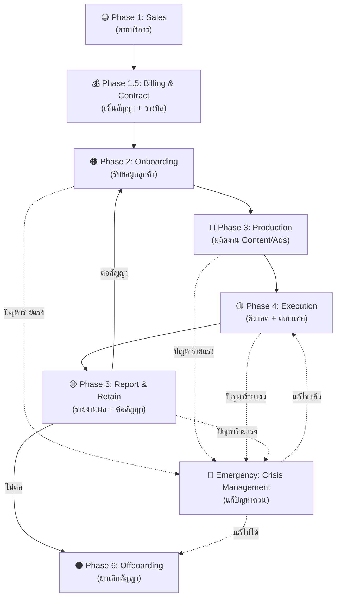
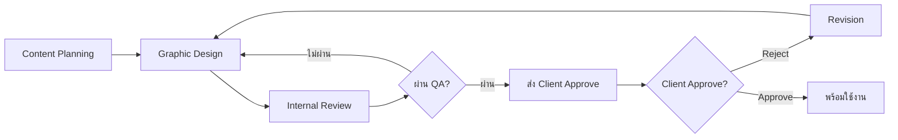

# 🔄 Agency Journey Flow v2.0 — End-to-End Client Lifecycle

> **The Complete Workflow from Sales to Offboarding**  
> สำหรับทีม Marktech Media — แสดงทุกขั้นตอนการให้บริการลูกค้า ตั้งแต่ขายได้จนถึงยกเลิกสัญญา

| รายการ | รายละเอียด |
|---|---|
| **เวอร์ชัน** | 2.0 (April 2026) |
| **สำหรับ** | ทีม Sale, AM, Content, Ads, Admin, Finance, CEO |
| **เชื่อมกับ** | Marktech OS — ทุก Phase ทำงานผ่านระบบ |

---

## 📋 Overview — ภาพรวมวงจรธุรกิจ

Marktech Media ให้บริการลูกค้าผ่าน **6 Phases หลัก + 1 Emergency Phase** ที่เชื่อมต่อกันเป็นเส้นตรง:

---

## 🟣 Phase 1: Sales (ขายบริการ)

> **เป้าหมาย:** ปิดการขายบริการ Marktech Media ให้ธุรกิจลูกค้า (คลินิก, ร้านค้า ฯลฯ)

### ทีมรับผิดชอบ
- **Sale** (ขายบริการ Marktech Media)

### Module ที่ใช้
- **Module 1B — Sales Pipeline**

### ขั้นตอนหลัก

| # | ขั้นตอน | รายละเอียด | SLA |
|---|---|---|---|
| 1 | **Prospect Identification** | หา Lead จากแหล่งต่างๆ (Referral, Cold Call, Event) | — |
| 2 | **First Contact** | โทร/LINE ติดต่อครั้งแรก แนะนำบริการ | ภายใน 24 ชม. หลัง Lead เข้า |
| 3 | **Demo & Presentation** | นำเสนอ Service Catalog + Case Study + ราคา | — |
| 4 | **Proposal Submission** | ส่งใบเสนอราคา (Quotation) พร้อมรายละเอียดบริการ | — |
| 5 | **Negotiation** | ต่อรองราคา/เงื่อนไข/ส่วนลด | — |
| 6 | **Close Deal** | ลูกค้าตกลงใช้บริการ → ส่งต่อ Finance เซ็นสัญญา | — |

### Service Catalog ที่เสนอ

| Service | รายละเอียด | ราคาเริ่มต้น |
|---|---|---|
| **Performance Marketing** | วางแผนโฆษณา + ยิงแอด + ปรับแอด + รายงานผล | ฿15,000/เดือน + งบแอด |
| **Marketing Content** | ผลิต Content 12 ชิ้น/เดือน + อัปโหลดเพจ | ฿8,000/เดือน |
| **Page Admin** | ตอบแชทเพจ 08:00-20:00 ทุกวัน | ฿10,000/เดือน |

### Output ของ Phase นี้
- [ ] ใบเสนอราคาที่ลูกค้า Approve
- [ ] Contact Info: ชื่อ, เบอร์, LINE, Email ของผู้ประสานงาน
- [ ] Service Package ที่เลือก + ราคา
- [ ] ข้อตกลงพิเศษ / ส่วนลด / เงื่อนไขเพิ่มเติม
- [ ] งบโฆษณา / เดือน (ถ้าเลือก Performance Marketing)
- [ ] Notes จาก Sale (สิ่งที่ลูกค้าให้ความสำคัญ)

### Handoff ไป Phase ถัดไป
**Sale → Finance** พร้อมเอกสาร:
- ใบเสนอราคา (Approved)
- Contact Info
- Service Package + ราคา
- Notes

---

## 💰 Phase 1.5: Billing & Contract (เซ็นสัญญาและวางบิล)

> **เป้าหมาย:** เซ็นสัญญาอย่างเป็นทางการ + ตั้งรอบวางบิล + เก็บค่ามัดจำ (ถ้ามี)

### ทีมรับผิดชอบ
- **Finance** (ออกสัญญา + วางบิล)
- **CEO** (อนุมัติสัญญา)

### Module ที่ใช้
- **Module 7 — Finance & Invoice**

### ขั้นตอนหลัก

| # | ขั้นตอน | รายละเอียด | SLA |
|---|---|---|---|
| 1 | **Contract Preparation** | Finance เตรียมสัญญา (ระยะเวลา, เงื่อนไข, ราคา) | ภายใน 2 วันทำการ |
| 2 | **Contract Signing** | ลูกค้าเซ็นสัญญา (PDF หรือ Hard Copy) | — |
| 3 | **Deposit Collection** | เก็บค่ามัดจำ (ถ้ามี) | ก่อนเริ่มงาน |
| 4 | **Billing Cycle Setup** | ตั้งรอบวางบิล (เช่น วันที่ 25 ของทุกเดือน) | — |
| 5 | **First Invoice** | ออกใบแจ้งหนี้งวดแรก | ตามรอบวางบิล |

### Output ของ Phase นี้
- [ ] สัญญาที่เซ็นแล้ว (PDF)
- [ ] ใบเสร็จค่ามัดจำ (ถ้ามี)
- [ ] Billing Cycle ตั้งค่าแล้วในระบบ
- [ ] Invoice งวดแรกออกแล้ว

### Handoff ไป Phase ถัดไป
**Finance → AM** พร้อมเอกสาร:
- สัญญาที่เซ็นแล้ว
- ใบเสนอราคา
- Contact Info
- Service Package
- วันที่เริ่มงาน

---

## 🟠 Phase 2: Onboarding (รับข้อมูลลูกค้า)

> **เป้าหมาย:** รวบรวมข้อมูลลูกค้าครบถ้วน เพื่อให้ทุกฝ่ายเริ่มงานได้ทันที

### ทีมรับผิดชอบ
- **AM (Account Manager)** — ประสานงานหลัก
- **ทุกฝ่าย** — Content, Ads, Admin

### Module ที่ใช้
- **Module 3 — Client Requirement Hub**

### ขั้นตอนหลัก

| # | ขั้นตอน | รายละเอียด | SLA |
|---|---|---|---|
| 1 | **Kick-off Meeting** | ประชุมลูกค้าครั้งแรก — แนะนำทีม, ตั้งความคาดหวัง | ภายใน 3 วันหลังเซ็นสัญญา |
| 2 | **Client Profile Card** | กรอกข้อมูลพื้นฐาน: ชื่อคลินิก, เจ้าของ, ช่องทางติดต่อ | ภายใน 1 วัน |
| 3 | **Brand Guideline Collection** | รับ CI, โลโก้, สี, ฟอนต์, โทนเสียง | ภายใน 3 วัน |
| 4 | **Access Granting** | ขอสิทธิ์ Facebook Page, Ad Account, LINE OA | ภายใน 5 วัน |
| 5 | **Requirement Checklist** | เก็บ Requirement เฉพาะ Service (ดูตารางด้านล่าง) | ภายใน 5 วัน |
| 6 | **Timeline & KPI Agreement** | ตกลง Deadline, KPI, และวิธีการ Approve งาน | ภายใน 5 วัน |

### Requirement Checklist ตาม Service

#### Performance Marketing Service
- [ ] งบโฆษณา / เดือน
- [ ] กลุ่มเป้าหมาย (อายุ, เพศ, พื้นที่)
- [ ] หัตถการ / บริการที่ให้ (เช่น Botox, Filler, Laser)
- [ ] โปรโมชันปัจจุบัน
- [ ] ข้อจำกัด / คำต้องห้าม (เช่น ห้ามใช้คำว่า "รักษา")
- [ ] KPI ที่ต้องการ (CPL, ROAS, จำนวน Lead)

#### Marketing Content Service
- [ ] จำนวน Content / เดือน (มาตรฐาน 12 ชิ้น)
- [ ] ธีม / แนวทางคอนเทนต์ที่ต้องการ
- [ ] ตัวอย่างโพสต์ที่ชอบ (Competitor หรือเพจอื่น)
- [ ] วันเวลาที่ต้องการโพสต์
- [ ] วิธีการ Approve (LINE / Email / ระบบ)

#### Page Admin Service
- [ ] เวลาที่ต้องการให้ตอบแชท (มาตรฐาน 08:00-20:00)
- [ ] สคริปต์การตอบ / FAQ
- [ ] ราคาบริการ / โปรโมชัน
- [ ] ข้อมูลหมอประจำ / ทีมงาน
- [ ] วิธีการส่งต่อลูกค้า (เช่น โทรหาคลินิก, จองผ่านระบบ)

### Output ของ Phase นี้
- [ ] Client Profile Card กรอกครบ
- [ ] Brand Guideline / CI ได้รับแล้ว
- [ ] Facebook Page Access — ได้รับ Admin/Editor
- [ ] Ad Account Access — ได้รับสิทธิ์
- [ ] LINE OA Access (ถ้ามี)
- [ ] Requirement Checklist ครบตาม Service
- [ ] Timeline & KPI ยืนยันแล้ว

### Handoff ไป Phase ถัดไป
**AM → ทุกฝ่าย** ผ่าน Module 3 (Client Requirement Hub):
- ข้อมูลไหลเข้าระบบอัตโนมัติ
- **Content Team** เห็น Brief + Brand Guideline
- **Ads Team** เห็น งบ + Target + KPI
- **Admin Team** เห็น โปรโมชัน + สคริปต์
- **AI RAG** ดูดข้อมูลเข้า Knowledge Base

---

## 🔵 Phase 3: Production (ผลิตงาน Content/Graphic/Ads)

> **เป้าหมาย:** ผลิตชิ้นงาน Content, Graphic, และตั้งค่า Ads Campaign

### ทีมรับผิดชอบ
- **Content** — เขียนแคปชัน
- **Graphic** — ออกแบบภาพ
- **Ads** — ตั้งค่า Campaign

### Module ที่ใช้
- **Module 2 — Operation & Content**

### ขั้นตอนหลัก

| # | ขั้นตอน | รายละเอียด | SLA |
|---|---|---|---|
| 1 | **Content Planning** | วางแผนธีม Content รายเดือน (12 ชิ้น) | ภายใน 3 วันหลัง Onboarding |
| 2 | **Graphic Design** | ออกแบบภาพตาม Brief + Brand Guideline | 2 วันต่อชิ้น |
| 3 | **Internal Review** | ทีมตรวจสอบคุณภาพก่อนส่ง Approve | 1 วัน |
| 4 | **Client Approval** | ส่งให้ลูกค้า Approve (ผ่าน LINE / Email / ระบบ) | ลูกค้าตอบภายใน 48 ชม. |
| 5 | **Revision** | แก้ไขตาม Feedback (สูงสุด 3 ครั้ง/ชิ้น) | 1 วันต่อรอบ |
| 6 | **Ads Campaign Setup** | ตั้งค่า Campaign, Ad Set, Creative บน Facebook Ads | 1 วัน |
| 7 | **Final QA** | เช็กคำต้องห้าม, ตรวจสอบ Targeting, Budget | ก่อนยิงแอด |

### Workflow: Content Production

### Quality Metrics
- **Revision Rate:** ≤ 3 ครั้ง/ชิ้น
- **On-time Delivery:** ≥ 90%
- **Client Approval Rate:** ≥ 80% ผ่านครั้งแรก

### Output ของ Phase นี้
- [ ] Content 12 ชิ้น (Approved)
- [ ] Ads Campaign ตั้งค่าเสร็จ (พร้อมยิง)
- [ ] Source Files เก็บไว้ (PSD, AI, Video)

### Handoff ไป Phase ถัดไป
**Production Team → Ads Team + Admin Team**:
- Content พร้อมอัปโหลด
- Ads Campaign พร้อมยิง
- โปรโมชัน + สคริปต์พร้อมใช้

---

## 🟢 Phase 4: Execution (ยิงแอด + ตอบแชท)

> **เป้าหมาย:** ยิงโฆษณา + ตอบแชทลูกค้า + ปิดการขาย

### ทีมรับผิดชอบ
- **Ads** — ยิงแอด + ปรับแอด
- **Admin** — ตอบแชทเพจลูกค้า

### Module ที่ใช้
- **Module 1A — Admin CRM**
- **Module 2 — Operation (Ads Performance Tracking)**

### ขั้นตอนหลัก

| # | ขั้นตอน | รายละเอียด | SLA |
|---|---|---|---|
| 1 | **Launch Ads** | เปิด Campaign บน Facebook Ads | วันแรกของเดือน |
| 2 | **Monitor Performance** | เช็กผล CPL, ROAS, CTR รายวัน | ทุกวัน |
| 3 | **Optimize Ads** | ปรับ Targeting, Budget, Creative ตามผล | รายสัปดาห์ |
| 4 | **Lead Routing** | ระบบจ่าย Lead ให้ Admin อัตโนมัติ | Real-time |
| 5 | **Admin Response** | Admin ตอบแชทลูกค้า | ≤ 5 นาที (เวลางาน) |
| 6 | **Close Deal** | Admin ปิดการขาย (จอง / สั่งซื้อ) | — |
| 7 | **Daily Summary** | Admin สรุปบทสนทนา + จำนวน Lead ปิด | ทุกวัน |

### Admin Performance Metrics
- **Response Time:** ≤ 5 นาที
- **Close Rate:** ≥ 30% (เกณฑ์ขั้นต่ำ)
- **Target Close Rate:** ≥ 40% (ได้ Incentive)

### Ads Performance Metrics
- **CPL (Cost Per Lead):** ตามเป้าที่ตกลงกับลูกค้า
- **ROAS (Return on Ad Spend):** ≥ 3x
- **CTR (Click-Through Rate):** ≥ 1.5%

### Escalation Rules

| Metric | Warning | Escalate to |
|---|---|---|
| **Admin Response Time** | > 15 นาที | AM |
| **Admin Close Rate** | < 30% ติดต่อกัน 2 สัปดาห์ | CEO (เข้า PIP) |
| **ROAS** | < 2x ติดต่อกัน 2 สัปดาห์ | CEO + ลูกค้าประชุมด่วน |
| **Client Complaint** | ร้องเรียนร้ายแรง | CEO ทันที |

### Output ของ Phase นี้
- Ads Performance Data (CPL, ROAS, Leads)
- Admin Performance Data (Response Time, Close Rate)
- Lead Data (จำนวน, สถานะ, มูลค่า)

---

## 🟡 Phase 5: Report & Retain (รายงานผล + ต่อสัญญา)

> **เป้าหมาย:** ส่งรายงานผลรายเดือน + ประเมินความพึงพอใจ + ต่อสัญญา

### ทีมรับผิดชอบ
- **AM** — ส่งรายงาน + ประชุมลูกค้า
- **CEO** — ตัดสินใจต่อสัญญา / ปรับราคา

### Module ที่ใช้
- **Module 3 — Client P&L Dashboard**
- **Module 7 — Finance & Invoice**

### ขั้นตอนหลัก

| # | ขั้นตอน | รายละเอียด | SLA |
|---|---|---|---|
| 1 | **Generate Report** | ระบบสร้างรายงานผลอัตโนมัติ (Ads, Admin, Content) | วันที่ 1 ของเดือนถัดไป |
| 2 | **Send Report** | AM ส่งรายงานให้ลูกค้า (Email + PDF) | ภายใน 2 วันทำการ |
| 3 | **Monthly Meeting** | ประชุมลูกค้า (Zoom / Onsite) สรุปผล + แนะนำปรับปรุง | ภายใน 5 วันทำการ |
| 4 | **NPS Survey** | ส่งแบบสอบถามความพึงพอใจ (NPS Score) | หลังประชุม |
| 5 | **Retention Plan** | ถ้า NPS < 7 → AM จัดทำแผนรักษาลูกค้า | ภายใน 3 วัน |
| 6 | **Contract Renewal** | 30 วันก่อนหมดสัญญา → เสนอต่อสัญญา | — |

### Monthly Report เนื้อหา

| หัวข้อ | รายละเอียด |
|---|---|
| **Ads Performance** | CPL, ROAS, Impressions, Clicks, CTR |
| **Lead Summary** | จำนวน Lead, Close Rate, มูลค่ารวม |
| **Content Performance** | Reach, Engagement, Top Posts |
| **Admin Performance** | Response Time, จำนวนแชท, Close Rate |
| **Recommendations** | แนะนำการปรับปรุงเดือนถัดไป |

### NPS Score & Actions

| NPS Score | ความหมาย | Action |
|---|---|---|
| **9-10** | Promoter (ลูกค้าพึงพอใจมาก) | ขอ Referral / Upsell บริการเพิ่ม |
| **7-8** | Passive (พอใจปานกลาง) | สอบถามปัญหา + ปรับปรุง |
| **0-6** | Detractor (ไม่พอใจ) | CEO เข้ามา + จัดทำ Retention Plan ด่วน |

### Output ของ Phase นี้
- [ ] Monthly Report ส่งแล้ว
- [ ] Monthly Meeting เสร็จแล้ว
- [ ] NPS Score บันทึกแล้ว
- [ ] Retention Plan (ถ้า NPS < 7)
- [ ] สถานะต่อสัญญา (ต่อ / ไม่ต่อ)

### Decision Point
- **ต่อสัญญา** → กลับไป Phase 2 (Onboarding รอบใหม่)
- **ไม่ต่อสัญญา** → ไป Phase 6 (Offboarding)

---

## ⚫ Phase 6: Offboarding (ยกเลิกสัญญา)

> **เป้าหมาย:** ส่งมอบงาน + คืนสิทธิ์ + เคลียร์ค่าบริการ + Archive ข้อมูล

### ทีมรับผิดชอบ
- **AM** — ประสานงานส่งมอบ
- **Finance** — เคลียร์ค่าบริการ

### Module ที่ใช้
- **Module 7 — Finance & Invoice**
- **Module 3 — Client Profile (Archive)**

### ขั้นตอนหลัก

| # | ขั้นตอน | รายละเอียด | SLA |
|---|---|---|---|
| 1 | **Notice Period** | ลูกค้าแจ้งยกเลิกล่วงหน้า (ตามสัญญา เช่น 30 วัน) | ตามสัญญา |
| 2 | **Exit Interview** | สอบถามเหตุผลการยกเลิก + Feedback | ภายใน 7 วัน |
| 3 | **Final Invoice** | ออกใบแจ้งหนี้งวดสุดท้าย | ตามรอบวางบิล |
| 4 | **Payment Clearance** | เคลียร์ค่าบริการค้าง + ค่าโฆษณาค้าง | ก่อนส่งมอบงาน |
| 5 | **Access Revocation** | คืนสิทธิ์ Facebook Page, Ad Account, LINE OA | ภายใน 3 วัน |
| 6 | **Asset Handover** | ส่งมอบ Source Files (PSD, AI, Video) + Content Calendar | ภายใน 7 วัน |
| 7 | **Final Report** | ส่งรายงานผลสุดท้าย | ภายใน 7 วัน |
| 8 | **Data Archive** | Archive ข้อมูลลูกค้าในระบบ | ภายใน 7 วัน |
| 9 | **PDPA Compliance** | ลบข้อมูลส่วนบุคคลตาม PDPA (หลัง 1 ปี) | หลัง 1 ปี |

### Offboarding Checklist
- [ ] แจ้งยกเลิกเป็นลายลักษณ์อักษร
- [ ] Exit Interview เสร็จแล้ว
- [ ] Final Invoice ออกแล้ว
- [ ] ค่าบริการค้างเคลียร์แล้ว
- [ ] ค่าโฆษณาค้างเคลียร์แล้ว
- [ ] คืน Deposit (ถ้ามี)
- [ ] คืน Facebook Page Admin Access
- [ ] คืน Ad Account Access
- [ ] คืน LINE OA Access
- [ ] ส่งมอบ Source Files ทั้งหมด
- [ ] ส่งมอบ Content Calendar & Assets
- [ ] ส่ง Final Performance Report
- [ ] Archive ข้อมูลลูกค้า
- [ ] ตั้งเวลาลบข้อมูลส่วนบุคคล (1 ปี)

### Output ของ Phase นี้
- Exit Interview Summary
- Final Report
- Offboarding Checklist (ครบ 100%)

---

## 🔴 Emergency: Crisis Management (แก้ปัญหาด่วน)

> **เป้าหมาย:** แก้ไขปัญหาร้ายแรงที่เกิดขึ้นระหว่างให้บริการ

### ทีมรับผิดชอบ
- **CEO** — ตัดสินใจสูงสุด
- **AM** — ประสานงานหลัก

### Module ที่ใช้
- **Module 6 — Ticketing & Escalation**

### ตัวอย่างสถานการณ์ Crisis

| สถานการณ์ | Severity | Response Time |
|---|---|---|
| **ลูกค้าโกรธมาก** | Critical | ≤ 30 นาที |
| **Ads ถูกแบน** | High | ≤ 2 ชม. |
| **ROAS ต่ำมาก** | High | ≤ 2 ชม. |
| **Admin ตอบผิด** | Medium | ≤ 4 ชม. |
| **Content ผิดพลาด** | Medium | ≤ 4 ชม. |

### ขั้นตอนหลัก

| # | ขั้นตอน | รายละเอียด | SLA |
|---|---|---|---|
| 1 | **Immediate Response** | AM/CEO โทรหาลูกค้าทันที | ≤ 30 นาที |
| 2 | **Root Cause Analysis** | หาสาเหตุปัญหา | ภายใน 2 ชม. |
| 3 | **Action Plan** | วางแผนแก้ไข + Timeline | ภายใน 4 ชม. |
| 4 | **Execute Fix** | ดำเนินการแก้ไข | ตาม Action Plan |
| 5 | **Follow-up** | ติดตามผลและรายงานลูกค้า | ทุกวัน จนแก้ไขเสร็จ |
| 6 | **Post-Mortem** | สรุปบทเรียน + ป้องกันไม่ให้เกิดซ้ำ | ภายใน 7 วัน |

### Escalation Matrix

| ระดับ | เงื่อนไข | ผู้รับผิดชอบ |
|---|---|---|
| **Level 1** | ปัญหาทั่วไป | AM |
| **Level 2** | ปัญหาซ้ำซาก / ลูกค้าไม่พอใจ | AM + Head of Team |
| **Level 3** | ปัญหาร้ายแรง / ลูกค้าขู่ยกเลิก | CEO |

---

## 📞 Communication Matrix — ใครคุยกับใคร ผ่านช่องทางไหน

| สถานการณ์ | ช่องทาง | ผู้รับผิดชอบ | SLA |
|---|---|---|---|
| **Prospect Follow-up** | โทร + LINE | Sale | ภายใน 24 ชม. หลัง Lead เข้า |
| **Onboarding ประสานงาน** | LINE Group (AM + ลูกค้า) | AM | ตอบภายใน 4 ชม. (เวลางาน) |
| **Content Approval** | ระบบ Approve / LINE | AM → ลูกค้า | ลูกค้าตอบภายใน 48 ชม. |
| **Admin ตอบแชท Lead** | Facebook Inbox / LINE OA | Admin | ภายใน 5 นาที (ในเวลางาน) |
| **Monthly Report** | Email + Meeting (Zoom/Onsite) | AM | ส่ง Report ก่อนประชุม 2 วัน |
| **Complaint / Escalation** | LINE / โทร | AM → CEO (ถ้า Critical) | Low: 24 ชม. / Critical: 2 ชม. |
| **Crisis** | โทรทันที + LINE Group | CEO + AM | ภายใน 30 นาที |
| **Invoice / Billing** | Email + LINE | Finance / AM | ส่งบิลตามรอบ |
| **Offboarding** | Email (เป็นทางการ) + Meeting | AM | ตาม Notice Period ในสัญญา |

---

## 📊 Key Metrics & SLA Summary

### Admin Performance
- **Response Time:** ≤ 5 นาที
- **Close Rate:** ≥ 30% (ขั้นต่ำ), ≥ 40% (เป้าหมาย)

### Ads Performance
- **CPL:** ตามเป้าที่ตกลงกับลูกค้า
- **ROAS:** ≥ 3x
- **CTR:** ≥ 1.5%

### Content Production
- **Revision Rate:** ≤ 3 ครั้ง/ชิ้น
- **On-time Delivery:** ≥ 90%
- **Client Approval Rate:** ≥ 80% ผ่านครั้งแรก

### Client Satisfaction
- **NPS Score:** ≥ 8 (เป้าหมาย)
- **Retention Rate:** ≥ 80%

### Billing & Payment
- **Payment On-time Rate:** ≥ 90%
- **Overdue Escalation:** Day 7 → Day 14 → Day 30

---

## 🔄 Continuous Improvement

หลังจบทุก Phase ให้ทีมทำ **Retrospective** เพื่อปรับปรุงกระบวนการ:

| หัวข้อ | คำถาม |
|---|---|
| **What went well?** | อะไรที่ทำได้ดี? |
| **What went wrong?** | อะไรที่เป็นปัญหา? |
| **What can we improve?** | ปรับปรุงอย่างไรให้ดีขึ้น? |
| **Action Items** | ทำอะไรต่อในรอบถัดไป? |

---

*Document Version 2.0 — April 2026*

**เชื่อมกับ Marktech OS:**
- ทุก Phase ทำงานผ่าน Module ต่างๆ ในระบบ
- ข้อมูลไหลเชื่อมต่อกันอัตโนมัติ
- Dashboard แสดงสถานะ Real-time
- Notification แจ้งเตือนตาม SLA
